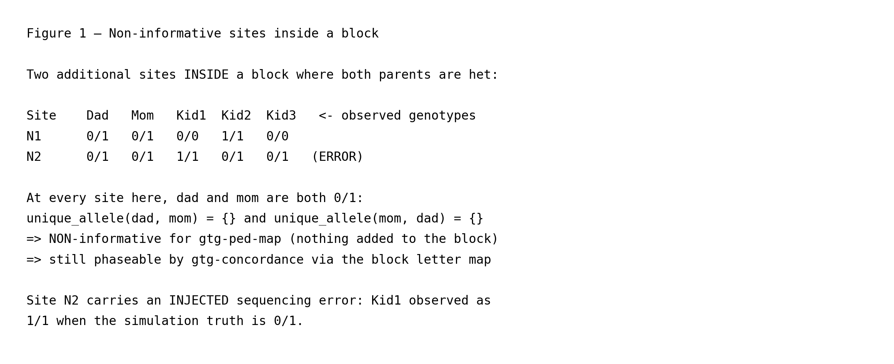
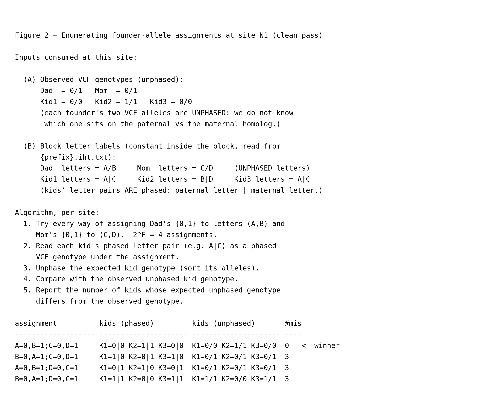
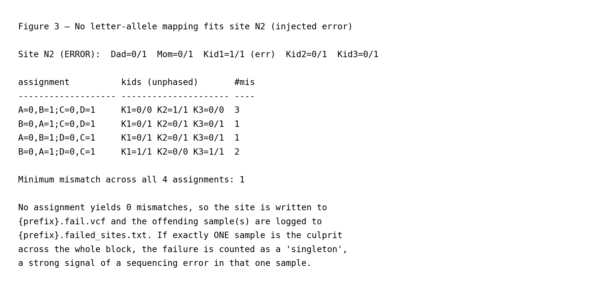
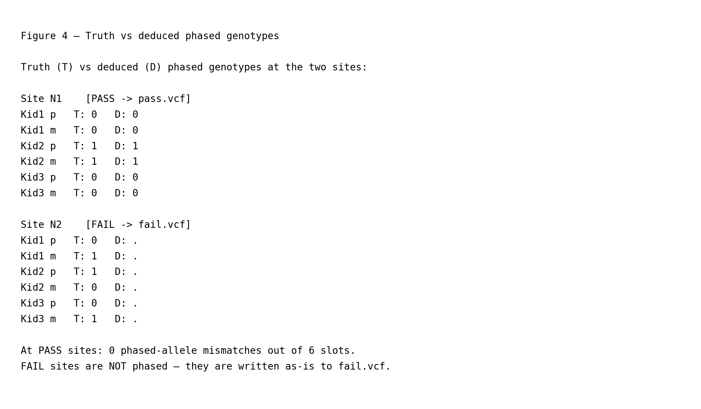

# Closing the loop with `gtg-concordance`

This page is part of the [wiki](../index.md) and picks up where the
[nuclear-family walkthrough](../nuclear_family/nuclear_family.md) left
off. `gtg-ped-map` emits only founder letters, and only at informative
sites; it never reconstructs the 0/1 allele sequence of any haplotype.
That job belongs to `gtg-concordance`, which re-reads the VCF for each
IHT block and phases **every** variant using the block's letter map.
All line numbers refer to commit `583ef82`. As in the other
walkthrough pages, each function link is followed by its call site in
the driver — `main()` in
[`gtg_concordance.rs`](https://github.com/Platinum-Pedigree-Consortium/Platinum-Pedigree-Inheritance/blob/583ef829a14f276f3a6cb1e2f34195d45397904f/code/rust/src/bin/gtg_concordance.rs#L315) — so you can step through
the driver source in parallel with this walkthrough.

The toy simulation reuses the left half of the nuclear-family block
(Kid1=(A,C), Kid2=(B,D), Kid3=(A,C)) and adds two sites where both
parents are heterozygous. These are NON-informative for `gtg-ped-map`
because [`unique_allele`](https://github.com/Platinum-Pedigree-Consortium/Platinum-Pedigree-Inheritance/blob/583ef829a14f276f3a6cb1e2f34195d45397904f/code/rust/src/bin/map_builder.rs#L243) returns `None` at each
of them, but `gtg-concordance` still has to phase them. One of the two
sites carries an injected sequencing error so both the clean-pass
(`pass.vcf`) and error-quarantine (`fail.vcf`) code paths are
exercised. Everything below is reproducible by running

```
python wiki/generate_wiki.py --page concordance
```

which regenerates both the figure PNGs referenced here and this
markdown file itself.

## 1. Block letter map — the input to `gtg-concordance`



The driver reads the `{prefix}.iht.txt` file produced by
`gtg-ped-map` using
[`parse_ihtv2_file`](https://github.com/Platinum-Pedigree-Consortium/Platinum-Pedigree-Inheritance/blob/583ef829a14f276f3a6cb1e2f34195d45397904f/code/rust/src/iht.rs#L606) (driver call at
[`gtg_concordance.rs:405`](https://github.com/Platinum-Pedigree-Consortium/Platinum-Pedigree-Inheritance/blob/583ef829a14f276f3a6cb1e2f34195d45397904f/code/rust/src/bin/gtg_concordance.rs#L405)). Each entry carries
one block's letter labels for every individual in the pedigree. Inside
this block the letters are constant; for the left half of the
nuclear-family chromosome they are the ones shown in Figure 1. Every
VCF record whose position falls inside the block is then handed to
the per-site phasing loop at
[`gtg_concordance.rs:437`](https://github.com/Platinum-Pedigree-Consortium/Platinum-Pedigree-Inheritance/blob/583ef829a14f276f3a6cb1e2f34195d45397904f/code/rust/src/bin/gtg_concordance.rs#L437) — including variants
that `gtg-ped-map` could not use because neither parent has a unique
allele.

## 2. Non-informative sites inside the block



The two sites in Figure 2 are both homozygous-absent for informative
patterns: dad is `0/1` and so is mom. `gtg-ped-map`'s
[`unique_allele`](https://github.com/Platinum-Pedigree-Consortium/Platinum-Pedigree-Inheritance/blob/583ef829a14f276f3a6cb1e2f34195d45397904f/code/rust/src/bin/map_builder.rs#L243) test therefore returns `None`
at both sites, so neither contributes to block construction. They
still enter `gtg-concordance`'s phasing loop; the per-site machinery
described below is what turns their unphased genotypes into either a
phased `pass.vcf` record or a quarantined `fail.vcf` record.

Site `N2` carries an **injected sequencing error**: Kid1 is reported
as `1/1` even though the simulation truth is `0/1`. This is the case
that the "impossible genotype" rule in Figure 4 is designed to catch.

## 3. Orientation enumeration at a clean site



At every record inside a block,
[`find_best_phase_orientation`](https://github.com/Platinum-Pedigree-Consortium/Platinum-Pedigree-Inheritance/blob/583ef829a14f276f3a6cb1e2f34195d45397904f/code/rust/src/bin/gtg_concordance.rs#L252) (driver call at
[`gtg_concordance.rs:454`](https://github.com/Platinum-Pedigree-Consortium/Platinum-Pedigree-Inheritance/blob/583ef829a14f276f3a6cb1e2f34195d45397904f/code/rust/src/bin/gtg_concordance.rs#L454)) enumerates the
`2^F=4` orientations produced by
[`Iht::founder_phase_orientations`](https://github.com/Platinum-Pedigree-Consortium/Platinum-Pedigree-Inheritance/blob/583ef829a14f276f3a6cb1e2f34195d45397904f/code/rust/src/iht.rs#L492) (invoked
inside `find_best_phase_orientation` at
[`gtg_concordance.rs:256`](https://github.com/Platinum-Pedigree-Consortium/Platinum-Pedigree-Inheritance/blob/583ef829a14f276f3a6cb1e2f34195d45397904f/code/rust/src/bin/gtg_concordance.rs#L256)). Each orientation is
a choice of which of dad's two sorted VCF alleles is tagged `A` vs `B`
and which of mom's two is tagged `C` vs `D`. Under a given
orientation,
[`Iht::assign_genotypes`](https://github.com/Platinum-Pedigree-Consortium/Platinum-Pedigree-Inheritance/blob/583ef829a14f276f3a6cb1e2f34195d45397904f/code/rust/src/iht.rs#L442) (driver call at
[`gtg_concordance.rs:487`](https://github.com/Platinum-Pedigree-Consortium/Platinum-Pedigree-Inheritance/blob/583ef829a14f276f3a6cb1e2f34195d45397904f/code/rust/src/bin/gtg_concordance.rs#L487) on the failing branch
and [`gtg_concordance.rs:514`](https://github.com/Platinum-Pedigree-Consortium/Platinum-Pedigree-Inheritance/blob/583ef829a14f276f3a6cb1e2f34195d45397904f/code/rust/src/bin/gtg_concordance.rs#L514) on the passing
branch) turns each kid's letter pair into an expected genotype. A
straight equality check —
[`compare_genotype_maps`](https://github.com/Platinum-Pedigree-Consortium/Platinum-Pedigree-Inheritance/blob/583ef829a14f276f3a6cb1e2f34195d45397904f/code/rust/src/bin/gtg_concordance.rs#L213) (driver call at
[`gtg_concordance.rs:268`](https://github.com/Platinum-Pedigree-Consortium/Platinum-Pedigree-Inheritance/blob/583ef829a14f276f3a6cb1e2f34195d45397904f/code/rust/src/bin/gtg_concordance.rs#L268)) — counts how many
samples disagree with the observation.

At site `N1`, exactly one of the four orientations explains every
sample simultaneously; the three others each force a mismatch
somewhere among the kids. The winning orientation fixes the
letter→allele map at this site, and the block's letter labels
immediately give the phased `p|m` genotypes shown beneath the
orientation table.

## 4. The "impossible genotype" rule



At site `N2` the injected error means **no** orientation produces zero
mismatches — the best any orientation can do is 1 sample(s)
disagreeing. `find_best_phase_orientation` therefore returns a
non-empty mismatch list, the driver writes the record to
`{prefix}.fail.vcf` at
[`gtg_concordance.rs:507`](https://github.com/Platinum-Pedigree-Consortium/Platinum-Pedigree-Inheritance/blob/583ef829a14f276f3a6cb1e2f34195d45397904f/code/rust/src/bin/gtg_concordance.rs#L507) (alongside the
low-quality and no-call records that were already routed to fail at
[`gtg_concordance.rs:444`](https://github.com/Platinum-Pedigree-Consortium/Platinum-Pedigree-Inheritance/blob/583ef829a14f276f3a6cb1e2f34195d45397904f/code/rust/src/bin/gtg_concordance.rs#L444) and
[`gtg_concordance.rs:450`](https://github.com/Platinum-Pedigree-Consortium/Platinum-Pedigree-Inheritance/blob/583ef829a14f276f3a6cb1e2f34195d45397904f/code/rust/src/bin/gtg_concordance.rs#L450)), and the offending
sample names are appended to `{prefix}.failed_sites.txt`. If
exactly one sample is the culprit across the whole block, the failure
is counted as a "singleton" — a strong signal of a sequencing error
in that one sample rather than a systemic block-labelling problem.

This is the mechanism by which `gtg-concordance` filters sequencing
errors, Mendelian violations, and residual block-labelling mistakes
without ever producing a phased call that the block's structural
labels cannot justify.

## 5. Truth versus deduced phased genotypes


At the PASS site (`N1`), every kid's deduced paternal and maternal
phased alleles match the simulation truth exactly
(0 mismatches out of 6 phased-allele slots). At
the FAIL site (`N2`), no phased output is emitted — the record lands
in `fail.vcf` untouched and the truth row in Figure 5 is shown only to
document what `gtg-concordance` declined to commit to.

This closes the pipeline. `gtg-ped-map` (`map_builder.rs`) is a pure
structural-labelling tool that operates on informative sites only and
writes founder letters per individual per block.
`gtg-concordance` (`gtg_concordance.rs`) is a pure phasing/QC tool
that uses those structural labels to assign alleles at every site in
the block: the passing records are phased via
[`Iht::assign_genotypes`](https://github.com/Platinum-Pedigree-Consortium/Platinum-Pedigree-Inheritance/blob/583ef829a14f276f3a6cb1e2f34195d45397904f/code/rust/src/iht.rs#L442) and emitted to
`{prefix}.pass.vcf` at
[`gtg_concordance.rs:534`](https://github.com/Platinum-Pedigree-Consortium/Platinum-Pedigree-Inheritance/blob/583ef829a14f276f3a6cb1e2f34195d45397904f/code/rust/src/bin/gtg_concordance.rs#L534), and the failing
records are quarantined to `{prefix}.fail.vcf` as described above.
The split is the answer to "does `gtg-ped-map` reconstruct the 0/1
allele sequence of each haplotype?": no, and deliberately — that is
handled exclusively by `gtg-concordance`.
