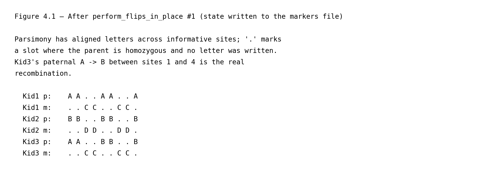
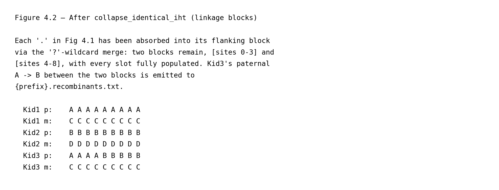
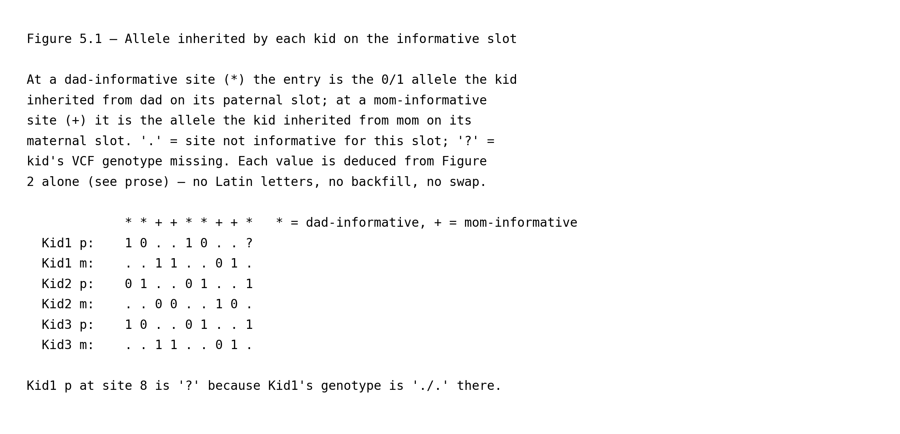
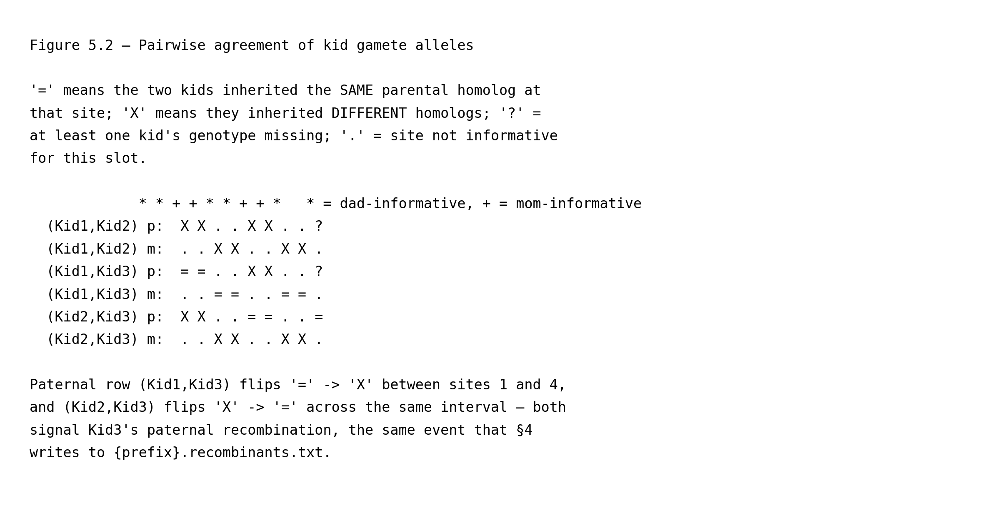
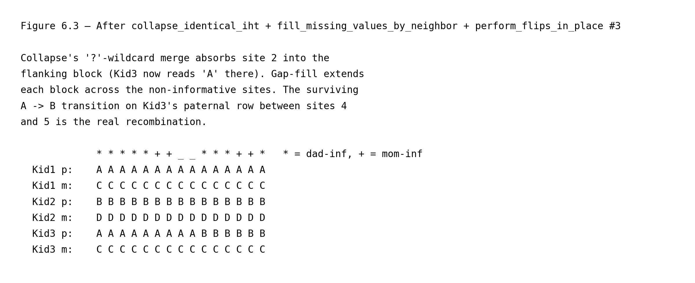

# Structural haplotype mapping in a nuclear family

This page is part of the [wiki](../index.md) and walks through
`gtg-ped-map`'s structural labelling algorithm on the simplest possible
pedigree: a two-generation nuclear family with two founders (dad and
mom) and three children. It complements the full
[`methods.md`](../methods.md) write-up by zooming in on the per-site
mechanics and pinning each figure to the exact Rust code that implements
it. All line numbers refer to commit `b550fd4`. Each function link is
followed by its call site in the driver — `main()` in
[`map_builder.rs`](https://github.com/Platinum-Pedigree-Consortium/Platinum-Pedigree-Inheritance/blob/b550fd4dcf3f4a5b8f0b7db59da79d30f5757945/code/rust/src/bin/map_builder.rs#L989) for `gtg-ped-map`, and `main()` in
[`gtg_concordance.rs`](https://github.com/Platinum-Pedigree-Consortium/Platinum-Pedigree-Inheritance/blob/b550fd4dcf3f4a5b8f0b7db59da79d30f5757945/code/rust/src/bin/gtg_concordance.rs#L315) for `gtg-concordance` —
so you can step through the driver source in parallel with this
walkthrough.

The toy simulation hard-codes four founder haplotypes over
9 sites and three children whose transmissions are known a
priori. Everything below is reproducible by running

```
python wiki/generate_wiki.py --page nuclear_family
```

which regenerates both the figure PNGs referenced here and this markdown
file itself.

## 1. Ground truth


Each column of Figure 1 corresponds to one biallelic SNV, and each
`0`/`1` entry is the allele carried by that homolog at that site:
`0` is the reference (REF) allele as recorded in the VCF, `1` is the
alternate (ALT) allele. (Indels and multi-allelic sites are filtered
out before this stage; see §2.)

Dad carries two physical homologs, named **α** and **β** here purely as
labels for the figure; mom carries **γ** and **δ**. We use Greek
letters at this stage to emphasise that these names refer to specific
*physical homologs* in the founders' cells. The Latin labels (`A`,
`B`, `C`, `D`) that `gtg-ped-map` eventually writes are something
different: they are *per-site, per-block* algorithm tags. The
phrase has two stages, both relevant downstream:

- **Per-site** refers to the raw per-VCF-record output described in
  §3: every site independently picks which of the parent's two
  letters goes to which group of kids (the grouping is the partition
  defined in §3 by the carrier test described there), so the same
  kid can be tagged `A` at one site and `B` at the next even though
  it inherited the same physical homolog. Figure 3 makes this
  visible in Kid2's paternal row.
- **Per-block** refers to what survives after the across-site
  reconciliation described in §4, which is what `gtg-ped-map`
  actually writes to disk: each contiguous block of sites that share
  the same partition gets one fixed, self-consistent labeling — but
  the block as a whole can still be flipped `A`↔`B` without losing
  any structural information, because the two letters in a founder's
  pair are interchangeable within any single block. That residual
  per-block freedom is what `gtg-concordance` resolves later by
  enumerating `2^F` founder-phase orientations (where `F` is the
  number of founders in the pedigree, i.e. one factor of 2 per
  founder for the independent A↔B / C↔D / … swap) and picking the
  one that best matches the observed alleles.

In neither stage are Latin letters pinned to a specific physical
homolog by `gtg-ped-map` itself, so it is a recurring source of
confusion to read `A` as a fixed name for dad's `α` homolog; it is
not.

In this simulation:

- **Kid1** inherits `(α, γ)` with no recombination.
- **Kid2** inherits `(β, δ)` with no recombination.
- **Kid3** inherits `(α|β, γ)` — the paternal slot crosses over between
  sites 3 and 4, so Kid3 carries dad's `α` homolog on sites 0–3 and
  dad's `β` homolog on sites 4–8.

At program startup, [`Iht::new`](https://github.com/Platinum-Pedigree-Consortium/Platinum-Pedigree-Inheritance/blob/b550fd4dcf3f4a5b8f0b7db59da79d30f5757945/code/rust/src/iht.rs#L172) (driver calls at
[`map_builder.rs:1059`](https://github.com/Platinum-Pedigree-Consortium/Platinum-Pedigree-Inheritance/blob/b550fd4dcf3f4a5b8f0b7db59da79d30f5757945/code/rust/src/bin/map_builder.rs#L1059) for the master template
and [`map_builder.rs:1111`](https://github.com/Platinum-Pedigree-Consortium/Platinum-Pedigree-Inheritance/blob/b550fd4dcf3f4a5b8f0b7db59da79d30f5757945/code/rust/src/bin/map_builder.rs#L1111) for each VCF site)
hands each founder a fresh pair of Latin letters — `(A,B)`, `(C,D)`,
`(E,F)`, … — *without* associating any allele or any physical homolog
with them. The letters are pure structural placeholders. The two
`Iht::new` call sites play different roles: the first builds a
**master template** that is never mutated — only its
[`legend()`](https://github.com/Platinum-Pedigree-Consortium/Platinum-Pedigree-Inheritance/blob/b550fd4dcf3f4a5b8f0b7db59da79d30f5757945/code/rust/src/iht.rs#L330) is read, to print the column header
(`Dad:A|B Mom:C|D Kid1:?|? …`) at the top of the output files. The
second allocates a fresh `local_iht` per VCF record that
[`track_alleles_through_pedigree`](https://github.com/Platinum-Pedigree-Consortium/Platinum-Pedigree-Inheritance/blob/b550fd4dcf3f4a5b8f0b7db59da79d30f5757945/code/rust/src/bin/map_builder.rs#L295) then *mutates*
in place to record which founder letter each child inherited at that
site. A per-site copy is needed rather than reusing the master because
(i) each site's IHT vector is itself an output, so it cannot be shared
across sites, and (ii) the master is hard-coded to
`ChromType::Autosome`, whereas `local_iht` uses the chromosome's
actual zygosity (autosome vs. chrX, decided at
[`map_builder.rs:1086`](https://github.com/Platinum-Pedigree-Consortium/Platinum-Pedigree-Inheritance/blob/b550fd4dcf3f4a5b8f0b7db59da79d30f5757945/code/rust/src/bin/map_builder.rs#L1086)), which changes how
letters are laid out for males on chrX.

The goal of `gtg-ped-map` is to recover exactly the Greek-labelled
transmissions above — but expressed in Latin letters and only as
*partitions* of the children, not as physical-homolog identities —
from the jointly-called *unphased* VCF alone (see §2), without ever
looking at the underlying 0/1 allele sequence.

## 2. Unphased VCF input


This is the only genotype information `gtg-ped-map` sees (plus the PED
file that declares who is whose parent). Two observations matter:

- **Haplotypes cannot be distinguished from genotypes alone.** A `0/1`
  call for dad does not reveal which of his two homologs carries the
  `1`, so a single-individual view has no way to label `A` vs `B`.
- **Patterns across the family resolve the ambiguity.** If dad is `0/1`
  while mom is `0/0`, then any child that also carries a `1` must have
  inherited dad's `1`-carrying homolog — precisely the logic of the
  informative-site test in the next section.

Only biallelic SNVs enter the map; indels are filtered at read time via
[`is_indel`](https://github.com/Platinum-Pedigree-Consortium/Platinum-Pedigree-Inheritance/blob/b550fd4dcf3f4a5b8f0b7db59da79d30f5757945/code/rust/src/bin/map_builder.rs#L501), invoked from the VCF-reading loop at
[`map_builder.rs:164`](https://github.com/Platinum-Pedigree-Consortium/Platinum-Pedigree-Inheritance/blob/b550fd4dcf3f4a5b8f0b7db59da79d30f5757945/code/rust/src/bin/map_builder.rs#L164) inside `parse_vcf` (the
driver calls `parse_vcf` at [`map_builder.rs:1092`](https://github.com/Platinum-Pedigree-Consortium/Platinum-Pedigree-Inheritance/blob/b550fd4dcf3f4a5b8f0b7db59da79d30f5757945/code/rust/src/bin/map_builder.rs#L1092)).

## 3. Informative-site detection, founder-letter tagging, and haplotype inference within a linkage block

This section describes what `gtg-ped-map` does at *each VCF record
independently*, and shows the three intermediate states the per-site
labels pass through (Figures 3.1, 3.2, 3.3 below). The two routines
involved —
[`track_alleles_through_pedigree`](https://github.com/Platinum-Pedigree-Consortium/Platinum-Pedigree-Inheritance/blob/b550fd4dcf3f4a5b8f0b7db59da79d30f5757945/code/rust/src/bin/map_builder.rs#L295) (driver call at
[`map_builder.rs:1116`](https://github.com/Platinum-Pedigree-Consortium/Platinum-Pedigree-Inheritance/blob/b550fd4dcf3f4a5b8f0b7db59da79d30f5757945/code/rust/src/bin/map_builder.rs#L1116)) and
[`backfill_sibs`](https://github.com/Platinum-Pedigree-Consortium/Platinum-Pedigree-Inheritance/blob/b550fd4dcf3f4a5b8f0b7db59da79d30f5757945/code/rust/src/bin/map_builder.rs#L804) (driver call at
[`map_builder.rs:1122`](https://github.com/Platinum-Pedigree-Consortium/Platinum-Pedigree-Inheritance/blob/b550fd4dcf3f4a5b8f0b7db59da79d30f5757945/code/rust/src/bin/map_builder.rs#L1122)) — are called once per
site, and together produce the final per-site Latin labels shown in
Figure 3.3. No
across-site reasoning has happened yet at this stage.

**Step 1 — informative-site detection.**
[`track_alleles_through_pedigree`](https://github.com/Platinum-Pedigree-Consortium/Platinum-Pedigree-Inheritance/blob/b550fd4dcf3f4a5b8f0b7db59da79d30f5757945/code/rust/src/bin/map_builder.rs#L295) walks the
pedigree in ancestor-first depth order and, for every
`(parent, spouse)` pair, calls
[`unique_allele`](https://github.com/Platinum-Pedigree-Consortium/Platinum-Pedigree-Inheritance/blob/b550fd4dcf3f4a5b8f0b7db59da79d30f5757945/code/rust/src/bin/map_builder.rs#L243) (from inside the walk at
[`map_builder.rs:315`](https://github.com/Platinum-Pedigree-Consortium/Platinum-Pedigree-Inheritance/blob/b550fd4dcf3f4a5b8f0b7db59da79d30f5757945/code/rust/src/bin/map_builder.rs#L315)) to ask whether the parent
carries an allele that the spouse does not. Two cases can arise:

- **Dad-informative** (dad het × mom hom): dad's unique allele tags
  whichever paternal homolog each child inherited. In this simulation
  these are sites `[0, 1, 4, 5, 8]`.
- **Mom-informative** (mom het × dad hom): symmetric, tagging the
  child's maternal slot. These are sites `[2, 3, 6, 7]`.

**Step 2 — tag carriers with the first letter.** At an informative
site the parent has two distinct alleles, exactly one of which is
*unique* to that parent (i.e. absent from the spouse). The
operational test for each child is then a single allele lookup at
that site: does the child's genotype contain the parent's unique
allele, yes or no? Define a child to be a **carrier** (of the
parent's unique allele, at this site) iff the answer is yes. If the
child is a carrier, it must have inherited the parental homolog that
carries the unique allele (since the spouse could not have donated
it); if not, the child must have inherited the parent's *other*
homolog (the one carrying the allele common to both parents). So the
children are partitioned into two groups by the carrier test. The
two letters of the parent's pair are handed out one per group, but
`track_alleles_through_pedigree` only writes a letter to the carrier
group: at [`map_builder.rs:333`](https://github.com/Platinum-Pedigree-Consortium/Platinum-Pedigree-Inheritance/blob/b550fd4dcf3f4a5b8f0b7db59da79d30f5757945/code/rust/src/bin/map_builder.rs#L333) it calls
[`find_valid_char`](https://github.com/Platinum-Pedigree-Consortium/Platinum-Pedigree-Inheritance/blob/b550fd4dcf3f4a5b8f0b7db59da79d30f5757945/code/rust/src/bin/map_builder.rs#L285), which returns the *first
valid* (non-`?`, non-`.`) entry in the parent's own slot pair, and
writes that letter to every carrier; the non-carriers are left as
`?` and resolved in Step 3. For the nuclear family on this page both
parents are founders, and [`Iht::new`](https://github.com/Platinum-Pedigree-Consortium/Platinum-Pedigree-Inheritance/blob/b550fd4dcf3f4a5b8f0b7db59da79d30f5757945/code/rust/src/iht.rs#L172) gave dad
the pair `(A, B)` and mom the pair `(C, D)` — both slots pre-filled —
so `find_valid_char` returns `A` at every dad-informative site and
`C` at every mom-informative site. (In deeper pedigrees a non-founder
parent may carry only one valid letter at a given site, in which
case `find_valid_char` returns whichever of the two slots is
populated; the same routine handles both cases.)


Figure 3.1 shows the state at the end of Step 2. Only the carrier
slots are filled; non-carriers and missing-genotype kids are still
`?`. Note Kid1 at site 8: its genotype is `./.` in the VCF (see
Figure 2), so the carrier test cannot run for Kid1 there and its
slot is `?`.

This per-site choice of "first letter to carriers" is arbitrary in
two senses. First, the parent's `(A, B)` pair was created at startup
with no physical-homolog identity attached. Second, the *carrier
group* itself is defined by whichever physical homolog happens to
carry the unique allele at that particular site, and that can flip
between sites. So the same kid can be tagged `A` at one site and `B`
at the next while the underlying transmission is unchanged — these
are independent draws of an arbitrary label, not real switches. The
IHT therefore records the *partition* (which kids inherited the same
parental homolog) reliably, but identifying `A` with one specific
physical homolog is a per-site, per-block free choice that downstream
code (`perform_flips_in_place`, see §4, and ultimately
`gtg-concordance`'s `2^F`-orientation enumeration) is responsible for
reconciling.

**Step 3 — sibling backfill.**
[`backfill_sibs`](https://github.com/Platinum-Pedigree-Consortium/Platinum-Pedigree-Inheritance/blob/b550fd4dcf3f4a5b8f0b7db59da79d30f5757945/code/rust/src/bin/map_builder.rs#L804) is then called for the same
site. Step 2 already split siblings into two groups (carriers vs
non-carriers) by which parental homolog they inherited; `backfill_sibs`
names the non-carrier group with the parent's other letter, on the
assumption that across a handful of siblings both founder homologs are
likely to have been transmitted. It runs in two sub-stages — a
non-carrier fill (3a) followed by a swap-by-majority normalisation (3b)
— plus a [multi-child guard](https://github.com/Platinum-Pedigree-Consortium/Platinum-Pedigree-Inheritance/blob/b550fd4dcf3f4a5b8f0b7db59da79d30f5757945/code/rust/src/bin/map_builder.rs#L818) that disables it for
one-child families.

**Step 3a — backfill non-carriers**
([fill loop at `map_builder.rs:848`](https://github.com/Platinum-Pedigree-Consortium/Platinum-Pedigree-Inheritance/blob/b550fd4dcf3f4a5b8f0b7db59da79d30f5757945/code/rust/src/bin/map_builder.rs#L848)). For every
sibling left as `?` after Step 2, write the parent's *other* letter
(`B` for dad, `D` for mom). For a confirmed non-carrier this is a
deduction — the kid's genotype lacks the parent's unique allele, so
it must have inherited the homolog carrying the allele common to both
parents. For a *missing-genotype* kid it is a default, not a deduction:
the VCF observed neither allele, so nothing about that kid's own
genotype pins its inheritance down, and the siblings' genotypes don't
constrain it either. Writing `B` is a bet on the higher-probability
outcome (that across several kids both homologs were transmitted) and
will be wrong in the minority of cases where every sibling happened
to inherit the same homolog; a wrong guess shows up later as a
spurious recombination in that kid's block.


Figure 3.2 shows the state at the end of Step 3a. Compared to
Figure 3.1, every informative slot is now filled. The interesting
column is site 8: Kid1's slot, which was `?` in Figure 3.1 because
the VCF genotype is missing, is now `B` — assigned under the
assumption that Kid1 inherited the homolog *not* transmitted to the
two tagged-`A` siblings (Kid2 and Kid3). This is a probabilistic
default: Kid1 could in principle have inherited the same homolog as
its siblings, in which case the `B` is wrong. Crucially, in this
state the rule "carriers always hold the first letter" still holds
strictly at every site.

**Step 3b — swap by majority**
([`map_builder.rs:881`](https://github.com/Platinum-Pedigree-Consortium/Platinum-Pedigree-Inheritance/blob/b550fd4dcf3f4a5b8f0b7db59da79d30f5757945/code/rust/src/bin/map_builder.rs#L881)). The motivation: assume
two neighboring informative sites are in perfect linkage — no
recombination between them in any kid. Then *the same subset of
kids* inherits a given parental homolog at both sites, so that
subset has a fixed size across the two sites and is therefore the
majority partition at both sites (or the minority at both). If we
adopt the convention "the first letter (`A` or `C`) always labels
the majority kid-partition," that letter tracks the same physical
homolog across the two sites, independent of which allele sits on
which homolog. Without this convention, the carrier-always-first
rule from Step 3a can flip the letter between sites that share the
same partition — because the carrier side is the majority at one
site and the minority at the other — even though no recombination
has occurred.

The mechanics: count how many sibling slots now carry each of the
two letters. If the letter assigned to carriers (`A` or `C`) ends
up in the *minority*, swap the two letters across all siblings so
the majority class always carries the first letter. This is a
deterministic per-site convention that, under the no-recombination
assumption above, produces consistent labels across linked sites
and simplifies later block reconciliation. The mom-informative sites in this simulation
are exactly that example: at sites 2, 3, 6, 7 the three kids split
the same way (`{Kid1, Kid3 | Kid2}`), but at site 2 the carrier
side is `{Kid1, Kid3}` (majority) while at sites 3, 6, 7 the carrier
is `{Kid2}` alone (minority). Compare Figure 3.2 and Figure 3.3 on
the maternal row to see the effect: in Figure 3.2 site 2 reads
`Kid1=C, Kid2=D, Kid3=C` while site 3 reads `Kid1=D, Kid2=C, Kid3=D`
— same partition, incompatible letters. After the swap-by-majority
flip at sites 3, 6, 7, Figure 3.3 shows all four sites uniformly as
`Kid1=C, Kid2=D, Kid3=C`.


Figure 3.3 shows the state at the end of Step 3b — the per-site
labels that feed the across-site reconciliation in §4. (They are
*not* the marker-file output verbatim: a flip pass at
[`map_builder.rs:1135`](https://github.com/Platinum-Pedigree-Consortium/Platinum-Pedigree-Inheritance/blob/b550fd4dcf3f4a5b8f0b7db59da79d30f5757945/code/rust/src/bin/map_builder.rs#L1135) runs between this
state and the marker-file write at
[`map_builder.rs:1142`](https://github.com/Platinum-Pedigree-Consortium/Platinum-Pedigree-Inheritance/blob/b550fd4dcf3f4a5b8f0b7db59da79d30f5757945/code/rust/src/bin/map_builder.rs#L1142), reconciling
founder letters between consecutive sites.) Compared to
Figure 3.2, sites whose carrier group was the minority now have
their entire row swapped. Site 1 of the paternal slot is the
clearest example: in Figure 3.2 Kid2 (the lone carrier) holds `A`
and the non-carriers Kid1 and Kid3 hold `B`; the swap sends Kid2 to
`B` and Kid1, Kid3 to `A`. The same flip occurs at sites 3, 6, 7
on the maternal slot. So between Figure 3.2 and Figure 3.3 the
"carrier always reads first letter" invariant is broken on
purpose — a trade Step 3b makes so that labels stay consistent
within a linkage block.

Step 3b pins the first letter to a single physical homolog, but
only across a linkage block: once any kid recombines between two
sites, the pin breaks at that boundary. In this pedigree the deduction is valid for the first four
sites — paternal sites 0, 1 share the partition
`{Kid1, Kid3 | Kid2}` with `A` naming dad's `α`, and maternal
sites 2, 3 share `{Kid1, Kid3 | Kid2}` with `C` naming mom's
`γ`. It breaks at site 4: Kid3 recombines on the paternal slot
between sites 3 and 4, so the paternal partition at sites 4, 5, 8
becomes `{Kid1 | Kid2, Kid3}`, and swap-by-majority re-pins
paternal `A` to the new majority `{Kid2, Kid3}` — which now
names dad's `β`, not `α`. That is why Kid2's paternal row in
Figure 3.3 reads `B` at sites 0, 1 but `A` at sites 4, 5, 8 even
though Kid2 inherits `β` throughout: the shift tracks a real
crossover in Kid3, not a label arbitrariness in Kid2. The
maternal slot has no crossover anywhere in this pedigree, so `C`
stays pinned to `γ` across all mom-informative sites 2, 3, 6, 7.
§4 turns these per-site partition labels into across-site
haplotypes: [`collapse_identical_iht`](https://github.com/Platinum-Pedigree-Consortium/Platinum-Pedigree-Inheritance/blob/b550fd4dcf3f4a5b8f0b7db59da79d30f5757945/code/rust/src/bin/map_builder.rs#L385)
groups each run of sites with the same partition into a block,
and [`perform_flips_in_place`](https://github.com/Platinum-Pedigree-Consortium/Platinum-Pedigree-Inheritance/blob/b550fd4dcf3f4a5b8f0b7db59da79d30f5757945/code/rust/src/bin/map_builder.rs#L702) then chooses
one `A`/`B` orientation per block so that consecutive blocks
agree on every kid that did *not* recombine, isolating Kid3's
crossover at the site 3–4 block boundary.

## 4. Expanding linkage blocks by minimizing recombinants

§3 delivers per-site partition labels whose convention is
consistent only *within* a linkage block — §3.3 flagged that the
`A`/`B` (or `C`/`D`) convention can flip across the boundary
between two adjacent blocks. §4 stitches these per-site labels
into the largest linkage blocks compatible with the data, so that
the only block boundaries that survive in the output correspond
to *real* recombinations.

The load-bearing routine is
[`perform_flips_in_place`](https://github.com/Platinum-Pedigree-Consortium/Platinum-Pedigree-Inheritance/blob/b550fd4dcf3f4a5b8f0b7db59da79d30f5757945/code/rust/src/bin/map_builder.rs#L702) (first driver
call at [`map_builder.rs:1135`](https://github.com/Platinum-Pedigree-Consortium/Platinum-Pedigree-Inheritance/blob/b550fd4dcf3f4a5b8f0b7db59da79d30f5757945/code/rust/src/bin/map_builder.rs#L1135); §6
describes the second and third calls). Its input is
the per-site sequence of `IhtVec` records built by the VCF loop:
each [`IhtVec`](https://github.com/Platinum-Pedigree-Consortium/Platinum-Pedigree-Inheritance/blob/b550fd4dcf3f4a5b8f0b7db59da79d30f5757945/code/rust/src/iht.rs#L139) pairs a `BedRecord`
(chromosome + start/end coordinates of the site) with an
[`Iht`](https://github.com/Platinum-Pedigree-Consortium/Platinum-Pedigree-Inheritance/blob/b550fd4dcf3f4a5b8f0b7db59da79d30f5757945/code/rust/src/iht.rs#L133) — two `sample_id → (hap_a, hap_b)`
maps, one for founders and one for children, storing each
sample's pair of letter slots at that site — along with a `count`
field that records how many per-site records have been merged
into this entry (1 until `collapse_identical_iht` runs, ≥1
afterwards) and a `non_missing_counts` table that
`fill_missing_values` later consults to pick majority-vote fills.
Walking this `Vec<IhtVec>` in genomic-coordinate order,
`perform_flips_in_place` compares each record with a predecessor
that is not necessarily the record's immediate VCF neighbor:
for each record it looks backward for the most recent preceding
record whose [`get_flipable_alleles`](https://github.com/Platinum-Pedigree-Consortium/Platinum-Pedigree-Inheritance/blob/b550fd4dcf3f4a5b8f0b7db59da79d30f5757945/code/rust/src/iht.rs#L554) set
is non-empty — i.e., the most recent site that carries at least
one non-`?` letter for a child of a multi-child founder. (A non-informative
site, or one whose child labels have been masked to `?`, has
nothing usable to compare against and is skipped.) Then, for
each founder, it considers applying the same per-founder swap
§3's swap-by-majority uses — exchange the founder's two letters
(`A`↔`B` for dad, `C`↔`D` for mom) across every one of that
founder's children at the current record — and keeps the swap
only if it lowers [`count_mismatches`](https://github.com/Platinum-Pedigree-Consortium/Platinum-Pedigree-Inheritance/blob/b550fd4dcf3f4a5b8f0b7db59da79d30f5757945/code/rust/src/bin/map_builder.rs#L791), the
number of kid slots whose letter differs between the current
record and that most-recent-flippable predecessor.

A non-recombinant kid's letter should agree between those two
records; a recombinant's must differ. So minimizing mismatches
is a parsimony rule: under the chosen per-founder swaps, the
kids whose letters still change between the two records *are*
the recombinants, and there are as few of them as the data
allows. This aligns with the biological prior that recombination
is rare (far less than one crossover per Mb per meiosis) —
recombinants end up as the minority kid-subset at each transition,
and every non-recombinant kid's letter is preserved, extending
the linkage block through them. Figure 4.1 shows the per-site
state this first flip pass produces — the state that
[`map_builder.rs:1142`](https://github.com/Platinum-Pedigree-Consortium/Platinum-Pedigree-Inheritance/blob/b550fd4dcf3f4a5b8f0b7db59da79d30f5757945/code/rust/src/bin/map_builder.rs#L1142) writes to the
marker file.



Every dot in Figure 4.1 is a `?` in the corresponding `IhtVec`'s
`Iht.children` slot: mom-informative sites leave paternal slots
`?` (and vice versa) because
[`track_alleles_through_pedigree`](https://github.com/Platinum-Pedigree-Consortium/Platinum-Pedigree-Inheritance/blob/b550fd4dcf3f4a5b8f0b7db59da79d30f5757945/code/rust/src/bin/map_builder.rs#L295) only
writes letters where the parent of that slot is heterozygous.
[`collapse_identical_iht`](https://github.com/Platinum-Pedigree-Consortium/Platinum-Pedigree-Inheritance/blob/b550fd4dcf3f4a5b8f0b7db59da79d30f5757945/code/rust/src/bin/map_builder.rs#L385) (driver call at
[`map_builder.rs:1191`](https://github.com/Platinum-Pedigree-Consortium/Platinum-Pedigree-Inheritance/blob/b550fd4dcf3f4a5b8f0b7db59da79d30f5757945/code/rust/src/bin/map_builder.rs#L1191)) then walks the
per-site vector, maintaining a single "accumulator" `IhtVec` —
the block currently being built — and extending it forward for
as long as the next record can be merged into it. Two records
can merge when [`can_merge_families`](https://github.com/Platinum-Pedigree-Consortium/Platinum-Pedigree-Inheritance/blob/b550fd4dcf3f4a5b8f0b7db59da79d30f5757945/code/rust/src/bin/map_builder.rs#L466) finds
every slot pair compatible under the `?`-as-wildcard rule;
[`merge_family_maps`](https://github.com/Platinum-Pedigree-Consortium/Platinum-Pedigree-Inheritance/blob/b550fd4dcf3f4a5b8f0b7db59da79d30f5757945/code/rust/src/bin/map_builder.rs#L483) then folds the next
record into the accumulator, overwriting any `?` in the
accumulator's slot with the incoming non-`?` letter. When the
next record can't merge — a concrete letter-vs-letter
disagreement indicates a real recombination — the accumulator
is pushed to the output and a new one is seeded from that
record, which becomes a surviving block boundary. So the dots
in Fig 4.1 get absorbed into flanking blocks and come out as
the block's letter.



Two blocks remain, `[sites 0-3]` and `[sites 4-8]`; within each
block every kid's slot pair is fully filled. Kid3's paternal
`A`→`B` between them is the only surviving boundary letter
change and is emitted to `{prefix}.recombinants.txt` by
[`summarize_child_changes`](https://github.com/Platinum-Pedigree-Consortium/Platinum-Pedigree-Inheritance/blob/b550fd4dcf3f4a5b8f0b7db59da79d30f5757945/code/rust/src/bin/map_builder.rs#L673) (driver call at
[`map_builder.rs:1228`](https://github.com/Platinum-Pedigree-Consortium/Platinum-Pedigree-Inheritance/blob/b550fd4dcf3f4a5b8f0b7db59da79d30f5757945/code/rust/src/bin/map_builder.rs#L1228)).

The driver makes two more `perform_flips_in_place` calls after
collapse (at [`map_builder.rs:1193`](https://github.com/Platinum-Pedigree-Consortium/Platinum-Pedigree-Inheritance/blob/b550fd4dcf3f4a5b8f0b7db59da79d30f5757945/code/rust/src/bin/map_builder.rs#L1193) and
[`map_builder.rs:1203`](https://github.com/Platinum-Pedigree-Consortium/Platinum-Pedigree-Inheritance/blob/b550fd4dcf3f4a5b8f0b7db59da79d30f5757945/code/rust/src/bin/map_builder.rs#L1203)), sandwiched around
[`fill_missing_values`](https://github.com/Platinum-Pedigree-Consortium/Platinum-Pedigree-Inheritance/blob/b550fd4dcf3f4a5b8f0b7db59da79d30f5757945/code/rust/src/bin/map_builder.rs#L617) and
[`fill_missing_values_by_neighbor`](https://github.com/Platinum-Pedigree-Consortium/Platinum-Pedigree-Inheritance/blob/b550fd4dcf3f4a5b8f0b7db59da79d30f5757945/code/rust/src/bin/map_builder.rs#L540) (at
[`map_builder.rs:1200`](https://github.com/Platinum-Pedigree-Consortium/Platinum-Pedigree-Inheritance/blob/b550fd4dcf3f4a5b8f0b7db59da79d30f5757945/code/rust/src/bin/map_builder.rs#L1200) and
[`map_builder.rs:1201`](https://github.com/Platinum-Pedigree-Consortium/Platinum-Pedigree-Inheritance/blob/b550fd4dcf3f4a5b8f0b7db59da79d30f5757945/code/rust/src/bin/map_builder.rs#L1201)). On this clean
toy these are all no-ops — collapse has already populated every
slot, no `?`s remain for the fill routines to act on, and the
second and third parsimony passes find no mismatches worth
swapping. §6 uses a simulation with a miscalled genotype and
non-informative sites that do leave `?`s inside blocks, so
these routines actually change state there; §6's prose walks
through them against the state they modify.

## 5. An equivalent pairwise-comparison algorithm

The machinery in §3-4 routes every kid's inheritance through
per-site Latin labels that §4 then stitches into blocks. The
same structural output — who shares a parental homolog where,
and where each kid recombines — falls out of a simpler three-
step procedure that never runs `perform_flips_in_place` or
`collapse_identical_iht`.

**The algorithm.** Three steps.

1. At every informative site, read each child's inherited allele
   on the informative slot (paternal at dad-informative sites,
   maternal at mom-informative sites) directly from the VCF: the
   homozygous parent's contribution is fixed, so whichever allele
   of the heterozygous parent remains after subtracting the
   homozygous one from the child's genotype is what that child
   inherited.
2. For every pair of children `(i, j)`, compare those inherited
   alleles site by site and record `=` (same allele) or `X`
   (different alleles).
3. From the pairwise grid, deduce the founder-haplotype
   segregation and recombinations (detailed below).



Figure 5.1 shows the output of step 1. Each entry is the raw 0/1
allele value the kid inherited from that parent on that slot —
read straight off the genotypes in Figure 2, nothing else.
(Worked check at site 0: Dad `0/1`, Mom `1/1`, Kid1 `1/1`; mom
donated a `1`, so Kid1's paternal allele is the other copy of
the genotype, which is also `1` — agreeing with Kid1 p = `1`.)
Kid1 p at site 8 is `?` because Kid1's VCF genotype is missing.



Figure 5.2 shows the output of step 2, the pairwise grid. Read
each row as "do these two kids share a parental homolog at this
site?": `(Kid1, Kid2) p` is `X` at every dad-informative site,
so Kid1 and Kid2 inherit two different dad homologs throughout.
`(Kid1, Kid3) p` is `=` on sites 0-1 and `X` on sites 4-5, so
Kid3 shares dad's homolog with Kid1 on the left half and with
Kid2 on the right — a recombination in dad's gamete to Kid3
between sites 1 and 4.

**Step 3 in detail.** The grid already determines which parental
homolog each kid inherited where; Latin letters (`A`/`B` for
dad's two homologs, `C`/`D` for mom's) are just names for those
classes. Apply the following procedure independently to each
parent's side — once over the paternal rows of Fig 5.2 using
dad's `A`/`B`, and once over the maternal rows using mom's
`C`/`D`:

- A contiguous run of sites across which every pair-relation
  involving that parent's slot holds constant is a single
  linkage block. Within the block, hand out the parent's two
  letters so that pairwise-`=` kids get the same letter and
  pairwise-`X` kids get different letters.
- A site at which any pair-relation flips (`=`→`X` or `X`→`=`)
  is a block boundary. To identify which kid recombined there,
  use the fact that when kid `k` switches homologs at the
  boundary, every pair-relation involving `k` flips (its
  agreement with every other kid now holds in the opposite
  sense) and every pair-relation that doesn't involve `k` is
  unchanged (those kids both kept their homologs). So the
  recombinant is the kid common to *every* flipped pair and
  absent from *every* unchanged pair. With three kids, the
  signature is two flipped pairs sharing a common kid plus one
  unchanged pair between the other two.
- Across a block boundary the parent's two letters can be
  swapped freely without changing any partition. Pick the
  orientation that keeps the most kids on the same letter across
  the boundary — every preserved letter is one fewer
  recombination. That is exactly the parsimony rule §4's
  `perform_flips_in_place` applies.

Applied to Figure 5.2's paternal rows: `(Kid1, Kid2) p` is all
`X`, so Kid1 and Kid2 carry different dad-letters throughout.
`(Kid1, Kid3) p` is `=` on sites 0-1 and `X` on sites 4-8, so
Kid1 and Kid3 share a dad-letter on the left block and differ
on the right. The only boundary is between sites 1 and 4, and
Kid3 is the lone kid whose pair-relations flip there — the
recombinant. Assigning Kid1=`A`, Kid2=`B` on the left forces
Kid3=`A` on the left and Kid3=`B` on the right. The maternal
side is even simpler — every maternal pair-relation is constant
across all four mom-informative sites, so there is one block,
no recombinations, and Kid1=Kid3=`C`, Kid2=`D`. The letter
assignment these rules produce matches Figure 4.2
character-for-character: the pairwise grid plus Step 3
reproduces §4's output without ever running
`perform_flips_in_place` or `collapse_identical_iht`.

**Why the pairwise view is a lens, not a replacement.**
`gtg-ped-map`'s output is structured as a **flat per-site
letter stream**: `{prefix}.markers.txt` has one line per VCF
record (chromosome, position, and every sample's pair of Latin
letters at that site, with `?` and `.` where no letter was
assigned), and `{prefix}.iht.txt` collapses runs of identical
records into block rows. Neither file stores pair-relations; the
flat stream plus a convention that `A` labels one of dad's
homologs within each block is enough to reconstruct the full
partition elsewhere. That letter-stream representation
generalises cleanly to deeper pedigrees — a grandchild's
paternal slot has to be labelled by whichever letter its parent
inherited from *its* parent, which is easier to express as a
letter than as a pair comparison (see the
[three-generation walkthrough](../three_generations/three_generations.md)).
The pairwise grid is a two-generation shortcut that makes the
underlying equivalence relation legible; the Rust machinery in
§3-4 exists to serialise the same equivalence relation into the
letter-stream format that scales.

## 6. Handling genotyping noise

§4 assumes every per-site partition is a real partition. A single
miscalled genotype breaks that assumption: flipping one kid's
carrier status at one site replaces the true partition with a
spurious one, and — without further work — parsimony would emit
two back-to-back "recombinations" around the outlier.

To show the machinery that catches this, §6 uses a minimal
5-site worked example: all five sites are
dad-informative, none of the three kids recombines, and
Kid3's genotype at site
2 is miscalled (its true genotype is 1/1
but the VCF reports 0/1). Kid3 therefore
appears to carry dad's unique allele at site
2 — a spurious partition outlier inside
an otherwise-linked block.

**Figure 6.1 — after the first flip pass.** §3's
carrier-tagging + swap-by-majority pipeline runs on this
simulation's per-site records, then
[`perform_flips_in_place`](https://github.com/Platinum-Pedigree-Consortium/Platinum-Pedigree-Inheritance/blob/b550fd4dcf3f4a5b8f0b7db59da79d30f5757945/code/rust/src/bin/map_builder.rs#L702) (driver call at
[`map_builder.rs:1135`](https://github.com/Platinum-Pedigree-Consortium/Platinum-Pedigree-Inheritance/blob/b550fd4dcf3f4a5b8f0b7db59da79d30f5757945/code/rust/src/bin/map_builder.rs#L1135)) aligns the
resulting labels across sites. The state below is what that
first flip pass produces — what the marker-file write at
[`map_builder.rs:1142`](https://github.com/Platinum-Pedigree-Consortium/Platinum-Pedigree-Inheritance/blob/b550fd4dcf3f4a5b8f0b7db59da79d30f5757945/code/rust/src/bin/map_builder.rs#L1142) records.


Kid3's paternal row reads `A A B A A`: the
`B` at site 2 is the noise outlier. Left
unmasked, it would look like two adjacent recombinations in
Kid3 — one into the outlier, one out — and
`{prefix}.recombinants.txt` would report both.

**Figure 6.2 — after noise masking.** The mask runs per kid,
per slot, in three steps:

1. [`collect_alleles_with_positions`](https://github.com/Platinum-Pedigree-Consortium/Platinum-Pedigree-Inheritance/blob/b550fd4dcf3f4a5b8f0b7db59da79d30f5757945/code/rust/src/bin/map_builder.rs#L916)
   (driver call at [`map_builder.rs:1170`](https://github.com/Platinum-Pedigree-Consortium/Platinum-Pedigree-Inheritance/blob/b550fd4dcf3f4a5b8f0b7db59da79d30f5757945/code/rust/src/bin/map_builder.rs#L1170))
   builds the per-(kid, slot) sequence of `(position, letter)`
   pairs by walking `pre_vector` and dropping every entry whose
   slot letter is `?`. One pair per informative site for that
   slot.
2. [`count_matching_neighbors`](https://github.com/Platinum-Pedigree-Consortium/Platinum-Pedigree-Inheritance/blob/b550fd4dcf3f4a5b8f0b7db59da79d30f5757945/code/rust/src/bin/map_builder.rs#L935) (driver
   call at [`map_builder.rs:1172`](https://github.com/Platinum-Pedigree-Consortium/Platinum-Pedigree-Inheritance/blob/b550fd4dcf3f4a5b8f0b7db59da79d30f5757945/code/rust/src/bin/map_builder.rs#L1172))
   receives that sequence and computes, for each focal
   position:
   - `count_before`: how far the contiguous run of the focal
     site's letter extends backward, *including the focal site
     itself*. Start at 1 and add 1 for each immediately-
     preceding site whose label matches; stop at the first
     site whose label differs.
   - `count_after`: the same, counting forward.
   The function returns only those focal sites where *both*
   `count_before` and `count_after` are strictly less than
   `--run` — i.e., sites whose letter forms only a short run on
   both sides.
3. [`mask_child_alleles`](https://github.com/Platinum-Pedigree-Consortium/Platinum-Pedigree-Inheritance/blob/b550fd4dcf3f4a5b8f0b7db59da79d30f5757945/code/rust/src/bin/map_builder.rs#L970) (driver call at
   [`map_builder.rs:1187`](https://github.com/Platinum-Pedigree-Consortium/Platinum-Pedigree-Inheritance/blob/b550fd4dcf3f4a5b8f0b7db59da79d30f5757945/code/rust/src/bin/map_builder.rs#L1187)) takes the
   returned positions and overwrites the corresponding slot
   in every `IhtVec` with `?`.

(Default `--run` is 10; this demo uses
`--run`=2, which flags any site whose run
is length 1 in both directions — an isolated letter whose
immediate neighbors on both sides differ. Worked trace of
Kid3's paternal sequence `A A B A A`:

| site | letter | count_before | count_after | flagged? |
|------|--------|--------------|-------------|----------|
| 0    | A      | 1            | 2           | no       |
| 1    | A      | 2            | 1           | no       |
| 2    | B      | 1            | 1           | **yes**  |
| 3    | A      | 1            | 2           | no       |
| 4    | A      | 2            | 1           | no       |

Only the `B` at site 2 has both counts
below 2, so it alone is masked to `?`.)


Only Kid3's paternal label at site
2 meets the threshold. The mask is
per-kid-per-slot, so the other kids' labels at site
2 are untouched.

**Figure 6.3 — after collapse.**
[`collapse_identical_iht`](https://github.com/Platinum-Pedigree-Consortium/Platinum-Pedigree-Inheritance/blob/b550fd4dcf3f4a5b8f0b7db59da79d30f5757945/code/rust/src/bin/map_builder.rs#L385) (driver call at
[`map_builder.rs:1191`](https://github.com/Platinum-Pedigree-Consortium/Platinum-Pedigree-Inheritance/blob/b550fd4dcf3f4a5b8f0b7db59da79d30f5757945/code/rust/src/bin/map_builder.rs#L1191)) walks the per-site
vector and merges adjacent records whose slot pairs are
compatible under the `?`-as-wildcard rule (see
[`can_merge_families`](https://github.com/Platinum-Pedigree-Consortium/Platinum-Pedigree-Inheritance/blob/b550fd4dcf3f4a5b8f0b7db59da79d30f5757945/code/rust/src/bin/map_builder.rs#L466)). Sites 0-1 merge
into one block with labels `(A, B, A)`; site 2 — now
`(A, B, ?)` after the mask — is compatible with the accumulator,
so it merges in and [`merge_family_maps`](https://github.com/Platinum-Pedigree-Consortium/Platinum-Pedigree-Inheritance/blob/b550fd4dcf3f4a5b8f0b7db59da79d30f5757945/code/rust/src/bin/map_builder.rs#L483)
overwrites Kid3's `?` with `A`. Sites 3-4
then merge in as well, producing a single block spanning all
five sites.



The noise is gone: one linkage block, `Kid1=A`, `Kid2=B`,
`Kid3=A` throughout, no spurious boundaries, and nothing written
to `{prefix}.recombinants.txt`.
