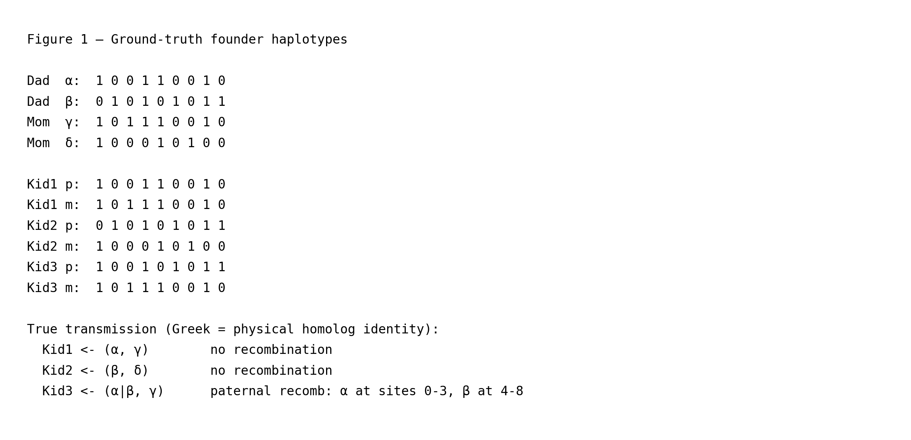
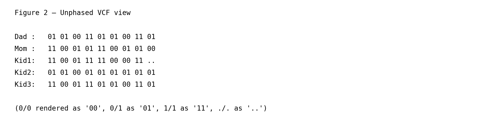
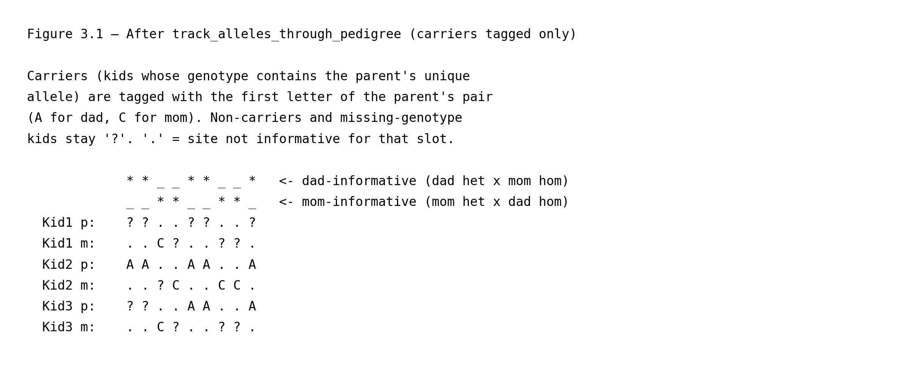
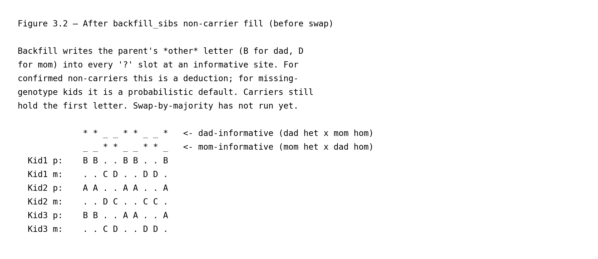
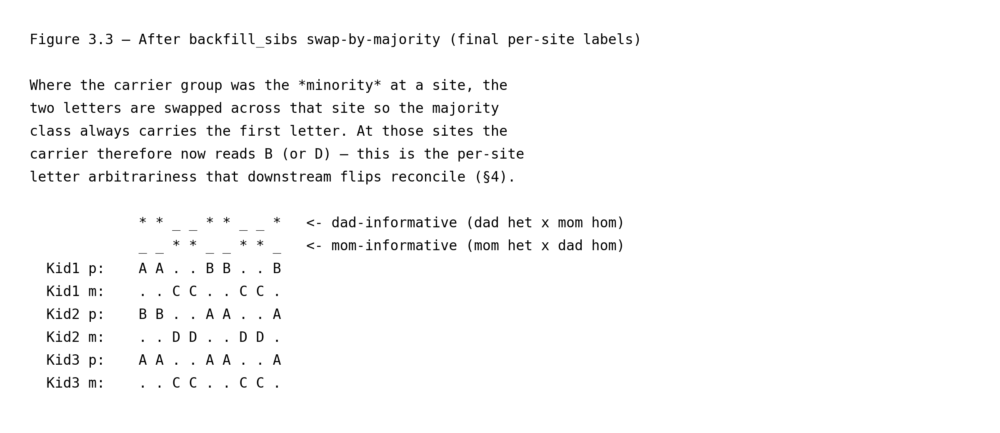
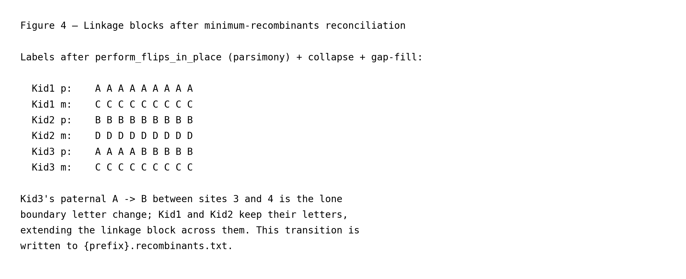
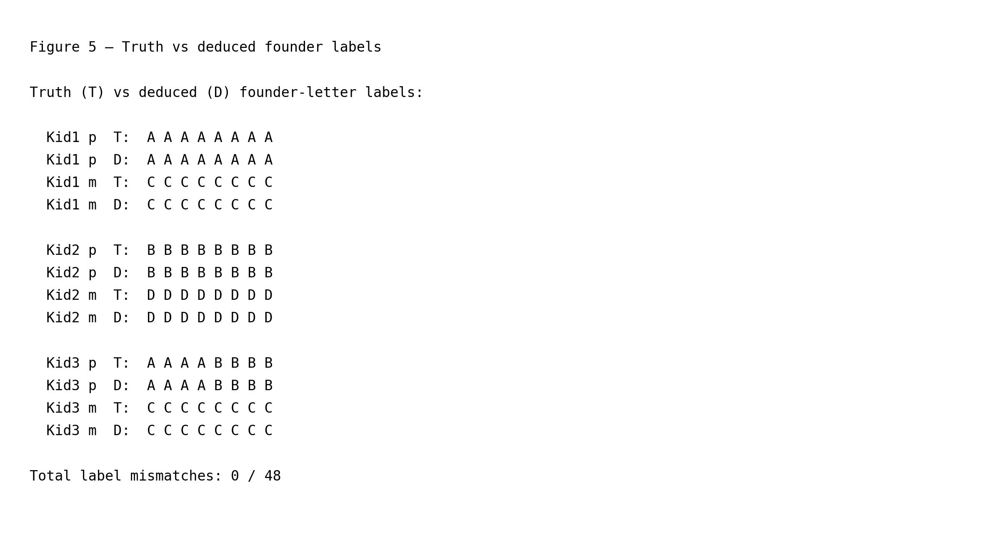
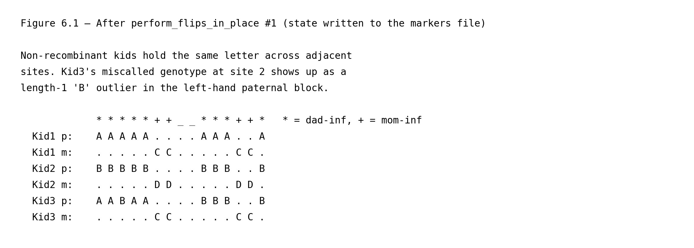
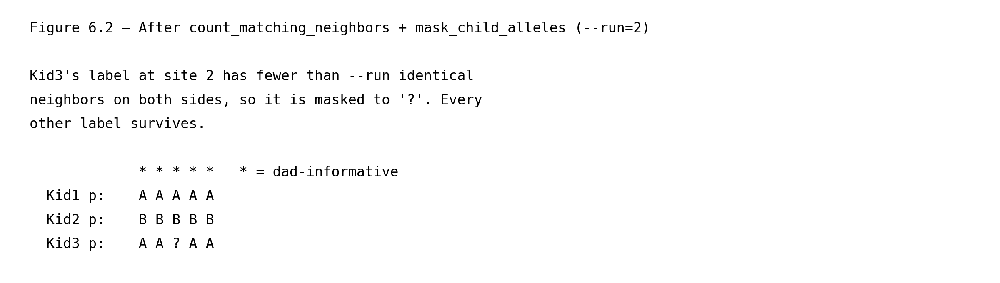

# Structural haplotype mapping in a nuclear family

This page is part of the [wiki](../index.md) and walks through
`gtg-ped-map`'s structural labelling algorithm on the simplest possible
pedigree: a two-generation nuclear family with two founders (dad and
mom) and three children. It complements the full
[`methods.md`](../methods.md) write-up by zooming in on the per-site
mechanics and pinning each figure to the exact Rust code that implements
it. All line numbers refer to commit `3f3d4e5`. Each function link is
followed by its call site in the driver — `main()` in
[`map_builder.rs`](https://github.com/Platinum-Pedigree-Consortium/Platinum-Pedigree-Inheritance/blob/3f3d4e539f217fc7be4d701ea3160ce80552f8c2/code/rust/src/bin/map_builder.rs#L989) for `gtg-ped-map`, and `main()` in
[`gtg_concordance.rs`](https://github.com/Platinum-Pedigree-Consortium/Platinum-Pedigree-Inheritance/blob/3f3d4e539f217fc7be4d701ea3160ce80552f8c2/code/rust/src/bin/gtg_concordance.rs#L315) for `gtg-concordance` —
so you can step through the driver source in parallel with this
walkthrough.

The toy simulation hard-codes four founder haplotypes over
9 sites and three children whose transmissions are known a
priori. Everything below is reproducible by running

```
python wiki/generate_wiki.py --page nuclear_family
```

which regenerates both the figure PNGs referenced here and this markdown
file itself.

## 1. Ground truth



Each column of Figure 1 corresponds to one biallelic SNV, and each
`0`/`1` entry is the allele carried by that homolog at that site:
`0` is the reference (REF) allele as recorded in the VCF, `1` is the
alternate (ALT) allele. (Indels and multi-allelic sites are filtered
out before this stage; see §2.)

Dad carries two physical homologs, named **α** and **β** here purely as
labels for the figure; mom carries **γ** and **δ**. We use Greek
letters at this stage to emphasise that these names refer to specific
*physical homologs* in the founders' cells. The Latin labels (`A`,
`B`, `C`, `D`) that `gtg-ped-map` eventually writes are something
different: they are *per-site, per-block* algorithm tags. The
phrase has two stages, both relevant downstream:

- **Per-site** refers to the raw per-VCF-record output described in
  §3: every site independently picks which of the parent's two
  letters goes to which group of kids (the grouping is the partition
  defined in §3 by the carrier test described there), so the same
  kid can be tagged `A` at one site and `B` at the next even though
  it inherited the same physical homolog. Figure 3 makes this
  visible in Kid2's paternal row.
- **Per-block** refers to what survives after the across-site
  reconciliation described in §4, which is what `gtg-ped-map`
  actually writes to disk: each contiguous block of sites that share
  the same partition gets one fixed, self-consistent labeling — but
  the block as a whole can still be flipped `A`↔`B` without losing
  any structural information, because the two letters in a founder's
  pair are interchangeable within any single block. That residual
  per-block freedom is what `gtg-concordance` resolves later by
  enumerating `2^F` founder-phase orientations (where `F` is the
  number of founders in the pedigree, i.e. one factor of 2 per
  founder for the independent A↔B / C↔D / … swap) and picking the
  one that best matches the observed alleles.

In neither stage are Latin letters pinned to a specific physical
homolog by `gtg-ped-map` itself, so it is a recurring source of
confusion to read `A` as a fixed name for dad's `α` homolog; it is
not.

In this simulation:

- **Kid1** inherits `(α, γ)` with no recombination.
- **Kid2** inherits `(β, δ)` with no recombination.
- **Kid3** inherits `(α|β, γ)` — the paternal slot crosses over between
  sites 3 and 4, so Kid3 carries dad's `α` homolog on sites 0–3 and
  dad's `β` homolog on sites 4–8.

At program startup, [`Iht::new`](https://github.com/Platinum-Pedigree-Consortium/Platinum-Pedigree-Inheritance/blob/3f3d4e539f217fc7be4d701ea3160ce80552f8c2/code/rust/src/iht.rs#L172) (driver calls at
[`map_builder.rs:1059`](https://github.com/Platinum-Pedigree-Consortium/Platinum-Pedigree-Inheritance/blob/3f3d4e539f217fc7be4d701ea3160ce80552f8c2/code/rust/src/bin/map_builder.rs#L1059) for the master template
and [`map_builder.rs:1111`](https://github.com/Platinum-Pedigree-Consortium/Platinum-Pedigree-Inheritance/blob/3f3d4e539f217fc7be4d701ea3160ce80552f8c2/code/rust/src/bin/map_builder.rs#L1111) for each VCF site)
hands each founder a fresh pair of Latin letters — `(A,B)`, `(C,D)`,
`(E,F)`, … — *without* associating any allele or any physical homolog
with them. The letters are pure structural placeholders. The two
`Iht::new` call sites play different roles: the first builds a
**master template** that is never mutated — only its
[`legend()`](https://github.com/Platinum-Pedigree-Consortium/Platinum-Pedigree-Inheritance/blob/3f3d4e539f217fc7be4d701ea3160ce80552f8c2/code/rust/src/iht.rs#L330) is read, to print the column header
(`Dad:A|B Mom:C|D Kid1:?|? …`) at the top of the output files. The
second allocates a fresh `local_iht` per VCF record that
[`track_alleles_through_pedigree`](https://github.com/Platinum-Pedigree-Consortium/Platinum-Pedigree-Inheritance/blob/3f3d4e539f217fc7be4d701ea3160ce80552f8c2/code/rust/src/bin/map_builder.rs#L295) then *mutates*
in place to record which founder letter each child inherited at that
site. A per-site copy is needed rather than reusing the master because
(i) each site's IHT vector is itself an output, so it cannot be shared
across sites, and (ii) the master is hard-coded to
`ChromType::Autosome`, whereas `local_iht` uses the chromosome's
actual zygosity (autosome vs. chrX, decided at
[`map_builder.rs:1086`](https://github.com/Platinum-Pedigree-Consortium/Platinum-Pedigree-Inheritance/blob/3f3d4e539f217fc7be4d701ea3160ce80552f8c2/code/rust/src/bin/map_builder.rs#L1086)), which changes how
letters are laid out for males on chrX.

The goal of `gtg-ped-map` is to recover exactly the Greek-labelled
transmissions above — but expressed in Latin letters and only as
*partitions* of the children, not as physical-homolog identities —
from the jointly-called *unphased* VCF alone (see §2), without ever
looking at the underlying 0/1 allele sequence.

## 2. Unphased VCF input



This is the only genotype information `gtg-ped-map` sees (plus the PED
file that declares who is whose parent). Two observations matter:

- **Haplotypes cannot be distinguished from genotypes alone.** A `0/1`
  call for dad does not reveal which of his two homologs carries the
  `1`, so a single-individual view has no way to label `A` vs `B`.
- **Patterns across the family resolve the ambiguity.** If dad is `0/1`
  while mom is `0/0`, then any child that also carries a `1` must have
  inherited dad's `1`-carrying homolog — precisely the logic of the
  informative-site test in the next section.

Only biallelic SNVs enter the map; indels are filtered at read time via
[`is_indel`](https://github.com/Platinum-Pedigree-Consortium/Platinum-Pedigree-Inheritance/blob/3f3d4e539f217fc7be4d701ea3160ce80552f8c2/code/rust/src/bin/map_builder.rs#L501), invoked from the VCF-reading loop at
[`map_builder.rs:164`](https://github.com/Platinum-Pedigree-Consortium/Platinum-Pedigree-Inheritance/blob/3f3d4e539f217fc7be4d701ea3160ce80552f8c2/code/rust/src/bin/map_builder.rs#L164) inside `parse_vcf` (the
driver calls `parse_vcf` at [`map_builder.rs:1092`](https://github.com/Platinum-Pedigree-Consortium/Platinum-Pedigree-Inheritance/blob/3f3d4e539f217fc7be4d701ea3160ce80552f8c2/code/rust/src/bin/map_builder.rs#L1092)).

## 3. Informative-site detection, letter tagging, and sibling backfill

This section describes what `gtg-ped-map` does at *each VCF record
independently*, and shows the three intermediate states the per-site
labels pass through (Figures 3.1, 3.2, 3.3 below). The two routines
involved —
[`track_alleles_through_pedigree`](https://github.com/Platinum-Pedigree-Consortium/Platinum-Pedigree-Inheritance/blob/3f3d4e539f217fc7be4d701ea3160ce80552f8c2/code/rust/src/bin/map_builder.rs#L295) (driver call at
[`map_builder.rs:1116`](https://github.com/Platinum-Pedigree-Consortium/Platinum-Pedigree-Inheritance/blob/3f3d4e539f217fc7be4d701ea3160ce80552f8c2/code/rust/src/bin/map_builder.rs#L1116)) and
[`backfill_sibs`](https://github.com/Platinum-Pedigree-Consortium/Platinum-Pedigree-Inheritance/blob/3f3d4e539f217fc7be4d701ea3160ce80552f8c2/code/rust/src/bin/map_builder.rs#L804) (driver call at
[`map_builder.rs:1122`](https://github.com/Platinum-Pedigree-Consortium/Platinum-Pedigree-Inheritance/blob/3f3d4e539f217fc7be4d701ea3160ce80552f8c2/code/rust/src/bin/map_builder.rs#L1122)) — are called once per
site, and together produce the final per-site Latin labels shown in
Figure 3.3. No
across-site reasoning has happened yet at this stage.

**Step 1 — informative-site detection.**
[`track_alleles_through_pedigree`](https://github.com/Platinum-Pedigree-Consortium/Platinum-Pedigree-Inheritance/blob/3f3d4e539f217fc7be4d701ea3160ce80552f8c2/code/rust/src/bin/map_builder.rs#L295) walks the
pedigree in ancestor-first depth order and, for every
`(parent, spouse)` pair, calls
[`unique_allele`](https://github.com/Platinum-Pedigree-Consortium/Platinum-Pedigree-Inheritance/blob/3f3d4e539f217fc7be4d701ea3160ce80552f8c2/code/rust/src/bin/map_builder.rs#L243) (from inside the walk at
[`map_builder.rs:315`](https://github.com/Platinum-Pedigree-Consortium/Platinum-Pedigree-Inheritance/blob/3f3d4e539f217fc7be4d701ea3160ce80552f8c2/code/rust/src/bin/map_builder.rs#L315)) to ask whether the parent
carries an allele that the spouse does not. Two cases can arise:

- **Dad-informative** (dad het × mom hom): dad's unique allele tags
  whichever paternal homolog each child inherited. In this simulation
  these are sites `[0, 1, 4, 5, 8]`.
- **Mom-informative** (mom het × dad hom): symmetric, tagging the
  child's maternal slot. These are sites `[2, 3, 6, 7]`.

**Step 2 — tag carriers with the first letter.** At an informative
site the parent has two distinct alleles, exactly one of which is
*unique* to that parent (i.e. absent from the spouse). The
operational test for each child is then a single allele lookup at
that site: does the child's genotype contain the parent's unique
allele, yes or no? Define a child to be a **carrier** (of the
parent's unique allele, at this site) iff the answer is yes. If the
child is a carrier, it must have inherited the parental homolog that
carries the unique allele (since the spouse could not have donated
it); if not, the child must have inherited the parent's *other*
homolog (the one carrying the allele common to both parents). So the
children are partitioned into two groups by the carrier test. The
two letters of the parent's pair are handed out one per group, but
`track_alleles_through_pedigree` only writes a letter to the carrier
group: at [`map_builder.rs:333`](https://github.com/Platinum-Pedigree-Consortium/Platinum-Pedigree-Inheritance/blob/3f3d4e539f217fc7be4d701ea3160ce80552f8c2/code/rust/src/bin/map_builder.rs#L333) it calls
[`find_valid_char`](https://github.com/Platinum-Pedigree-Consortium/Platinum-Pedigree-Inheritance/blob/3f3d4e539f217fc7be4d701ea3160ce80552f8c2/code/rust/src/bin/map_builder.rs#L285), which returns the *first
valid* (non-`?`, non-`.`) entry in the parent's own slot pair, and
writes that letter to every carrier; the non-carriers are left as
`?` and resolved in Step 3. For the nuclear family on this page both
parents are founders, and [`Iht::new`](https://github.com/Platinum-Pedigree-Consortium/Platinum-Pedigree-Inheritance/blob/3f3d4e539f217fc7be4d701ea3160ce80552f8c2/code/rust/src/iht.rs#L172) gave dad
the pair `(A, B)` and mom the pair `(C, D)` — both slots pre-filled —
so `find_valid_char` returns `A` at every dad-informative site and
`C` at every mom-informative site. (In deeper pedigrees a non-founder
parent may carry only one valid letter at a given site, in which
case `find_valid_char` returns whichever of the two slots is
populated; the same routine handles both cases.)



Figure 3.1 shows the state at the end of Step 2. Only the carrier
slots are filled; non-carriers and missing-genotype kids are still
`?`. Note Kid1 at site 8: its genotype is `./.` in the VCF (see
Figure 2), so the carrier test cannot run for Kid1 there and its
slot is `?`.

This per-site choice of "first letter to carriers" is arbitrary in
two senses. First, the parent's `(A, B)` pair was created at startup
with no physical-homolog identity attached. Second, the *carrier
group* itself is defined by whichever physical homolog happens to
carry the unique allele at that particular site, and that can flip
between sites. So the same kid can be tagged `A` at one site and `B`
at the next while the underlying transmission is unchanged — these
are independent draws of an arbitrary label, not real switches. The
IHT therefore records the *partition* (which kids inherited the same
parental homolog) reliably, but identifying `A` with one specific
physical homolog is a per-site, per-block free choice that downstream
code (`perform_flips_in_place`, see §4, and ultimately
`gtg-concordance`'s `2^F`-orientation enumeration) is responsible for
reconciling.

**Step 3 — sibling backfill.**
[`backfill_sibs`](https://github.com/Platinum-Pedigree-Consortium/Platinum-Pedigree-Inheritance/blob/3f3d4e539f217fc7be4d701ea3160ce80552f8c2/code/rust/src/bin/map_builder.rs#L804) is then called for the same
site. Step 2 already split siblings into two groups (carriers vs
non-carriers) by which parental homolog they inherited; `backfill_sibs`
names the non-carrier group with the parent's other letter, on the
assumption that across a handful of siblings both founder homologs are
likely to have been transmitted. It runs in two sub-stages — a
non-carrier fill (3a) followed by a swap-by-majority normalisation (3b)
— plus a [multi-child guard](https://github.com/Platinum-Pedigree-Consortium/Platinum-Pedigree-Inheritance/blob/3f3d4e539f217fc7be4d701ea3160ce80552f8c2/code/rust/src/bin/map_builder.rs#L818) that disables it for
one-child families.

**Step 3a — backfill non-carriers**
([fill loop at `map_builder.rs:848`](https://github.com/Platinum-Pedigree-Consortium/Platinum-Pedigree-Inheritance/blob/3f3d4e539f217fc7be4d701ea3160ce80552f8c2/code/rust/src/bin/map_builder.rs#L848)). For every
sibling left as `?` after Step 2, write the parent's *other* letter
(`B` for dad, `D` for mom). For a confirmed non-carrier this is a
deduction — the kid's genotype lacks the parent's unique allele, so
it must have inherited the homolog carrying the allele common to both
parents. For a *missing-genotype* kid it is a default, not a deduction:
the VCF observed neither allele, so nothing about that kid's own
genotype pins its inheritance down, and the siblings' genotypes don't
constrain it either. Writing `B` is a bet on the higher-probability
outcome (that across several kids both homologs were transmitted) and
will be wrong in the minority of cases where every sibling happened
to inherit the same homolog; a wrong guess shows up later as a
spurious recombination in that kid's block.



Figure 3.2 shows the state at the end of Step 3a. Compared to
Figure 3.1, every informative slot is now filled. The interesting
column is site 8: Kid1's slot, which was `?` in Figure 3.1 because
the VCF genotype is missing, is now `B` — assigned under the
assumption that Kid1 inherited the homolog *not* transmitted to the
two tagged-`A` siblings (Kid2 and Kid3). This is a probabilistic
default: Kid1 could in principle have inherited the same homolog as
its siblings, in which case the `B` is wrong. Crucially, in this
state the rule "carriers always hold the first letter" still holds
strictly at every site.

**Step 3b — swap by majority**
([`map_builder.rs:881`](https://github.com/Platinum-Pedigree-Consortium/Platinum-Pedigree-Inheritance/blob/3f3d4e539f217fc7be4d701ea3160ce80552f8c2/code/rust/src/bin/map_builder.rs#L881)). Count how many sibling
slots now carry each of the two letters. If the letter assigned to
carriers (`A` or `C`) ends up in the *minority*, swap the two
letters across all siblings so the majority class always carries
the first letter. This is a deterministic per-site convention so
that two sites whose kids fall into *the same partition* — but where
the carrier side is the majority at one site and the minority at the
other — nevertheless emerge with consistent labels, simplifying later
block reconciliation. The mom-informative sites in this simulation
are exactly that example: at sites 2, 3, 6, 7 the three kids split
the same way (`{Kid1, Kid3 | Kid2}`), but at site 2 the carrier
side is `{Kid1, Kid3}` (majority) while at sites 3, 6, 7 the carrier
is `{Kid2}` alone (minority). Compare Figure 3.2 and Figure 3.3 on
the maternal row to see the effect: in Figure 3.2 site 2 reads
`Kid1=C, Kid2=D, Kid3=C` while site 3 reads `Kid1=D, Kid2=C, Kid3=D`
— same partition, incompatible letters. After the swap-by-majority
flip at sites 3, 6, 7, Figure 3.3 shows all four sites uniformly as
`Kid1=C, Kid2=D, Kid3=C`.



Figure 3.3 shows the state at the end of Step 3b — the labels
`gtg-ped-map` actually writes for this VCF record. Compared to
Figure 3.2, sites whose carrier group was the minority now have
their entire row swapped. Site 1 of the paternal slot is the
clearest example: in Figure 3.2 Kid2 (the lone carrier) holds `A`
and the non-carriers Kid1 and Kid3 hold `B`; the swap sends Kid2 to
`B` and Kid1, Kid3 to `A`. The same flip occurs at sites 3, 6, 7
on the maternal slot. So between Figure 3.2 and Figure 3.3 the
"carrier always reads first letter" invariant is broken on
purpose — this is the per-site letter arbitrariness that downstream
flips reconcile (§4).

**Step 3c — skip families with one child** (the
`children.len() > 1` guard at
[`map_builder.rs:818`](https://github.com/Platinum-Pedigree-Consortium/Platinum-Pedigree-Inheritance/blob/3f3d4e539f217fc7be4d701ea3160ce80552f8c2/code/rust/src/bin/map_builder.rs#L818)). With a single child
there is no sibling partition to exploit and the swap-by-majority
step has no majority to measure.

Because the depth-ordered walk in Step 1 always processes a parent
before its children, [`get_iht_markers`](https://github.com/Platinum-Pedigree-Consortium/Platinum-Pedigree-Inheritance/blob/3f3d4e539f217fc7be4d701ea3160ce80552f8c2/code/rust/src/bin/map_builder.rs#L274) (called
from inside the walk at [`map_builder.rs:328`](https://github.com/Platinum-Pedigree-Consortium/Platinum-Pedigree-Inheritance/blob/3f3d4e539f217fc7be4d701ea3160ce80552f8c2/code/rust/src/bin/map_builder.rs#L328))
reads the parent's already-assigned letters when propagating to the
next generation, which is what makes the method look "recursive"
across generations while being expressed as a single loop.

Non-informative sites (both parents het, or both hom for the same
allele) contribute nothing at this stage and are rendered as `.` in
all three figures. The two indicator rows (`*` marks informative
sites, `_` marks non-informative ones) sit directly above the kid
rows, with every column aligned, so you can read each letter
assignment straight up to the indicator that produced it. Each kid's
paternal row (`p`) sits directly above its maternal row (`m`).
Notice in Figure 3.3 that Kid2's paternal row is *not* a uniform run
of one letter even though Kid2 inherits the same physical homolog
(`β`) at every dad-informative site: the per-site `A`/`B` assignment
shifts as the carrier group and its majority shift across sites.
That apparent letter switching is the per-site arbitrariness
introduced by Step 3b — it is not a real recombination signal, and
§4's flip pass is what reconciles it.

## 4. Block collapse, noise filtering, and flip reconciliation



The per-site labels in Figure 3 are correct as *partitions* of the
children but, as flagged in §3, the letter convention can flip from
site to site. Several Rust routines reconcile and clean the trace up
before it is written to disk:

1. [`collapse_identical_iht`](https://github.com/Platinum-Pedigree-Consortium/Platinum-Pedigree-Inheritance/blob/3f3d4e539f217fc7be4d701ea3160ce80552f8c2/code/rust/src/bin/map_builder.rs#L385) (driver call at
   [`map_builder.rs:1191`](https://github.com/Platinum-Pedigree-Consortium/Platinum-Pedigree-Inheritance/blob/3f3d4e539f217fc7be4d701ea3160ce80552f8c2/code/rust/src/bin/map_builder.rs#L1191)) merges adjacent
   sites with compatible letter assignments into blocks, while
   [`fill_missing_values`](https://github.com/Platinum-Pedigree-Consortium/Platinum-Pedigree-Inheritance/blob/3f3d4e539f217fc7be4d701ea3160ce80552f8c2/code/rust/src/bin/map_builder.rs#L617) (driver call at
   [`map_builder.rs:1200`](https://github.com/Platinum-Pedigree-Consortium/Platinum-Pedigree-Inheritance/blob/3f3d4e539f217fc7be4d701ea3160ce80552f8c2/code/rust/src/bin/map_builder.rs#L1200)) and
   [`fill_missing_values_by_neighbor`](https://github.com/Platinum-Pedigree-Consortium/Platinum-Pedigree-Inheritance/blob/3f3d4e539f217fc7be4d701ea3160ce80552f8c2/code/rust/src/bin/map_builder.rs#L540) (driver
   call at [`map_builder.rs:1201`](https://github.com/Platinum-Pedigree-Consortium/Platinum-Pedigree-Inheritance/blob/3f3d4e539f217fc7be4d701ea3160ce80552f8c2/code/rust/src/bin/map_builder.rs#L1201)) fill the
   `.` gaps visible in Figure 3.3 from flanking blocks.
2. [`count_matching_neighbors`](https://github.com/Platinum-Pedigree-Consortium/Platinum-Pedigree-Inheritance/blob/3f3d4e539f217fc7be4d701ea3160ce80552f8c2/code/rust/src/bin/map_builder.rs#L935) (driver call at
   [`map_builder.rs:1172`](https://github.com/Platinum-Pedigree-Consortium/Platinum-Pedigree-Inheritance/blob/3f3d4e539f217fc7be4d701ea3160ce80552f8c2/code/rust/src/bin/map_builder.rs#L1172)) and
   [`mask_child_alleles`](https://github.com/Platinum-Pedigree-Consortium/Platinum-Pedigree-Inheritance/blob/3f3d4e539f217fc7be4d701ea3160ce80552f8c2/code/rust/src/bin/map_builder.rs#L970) (driver call at
   [`map_builder.rs:1187`](https://github.com/Platinum-Pedigree-Consortium/Platinum-Pedigree-Inheritance/blob/3f3d4e539f217fc7be4d701ea3160ce80552f8c2/code/rust/src/bin/map_builder.rs#L1187)) identify isolated
   runs shorter than `--run` (default 10 markers) and mask them back
   to `?` as likely sequencing noise, so that collapse does not
   invent spurious recombinations.
3. [`perform_flips_in_place`](https://github.com/Platinum-Pedigree-Consortium/Platinum-Pedigree-Inheritance/blob/3f3d4e539f217fc7be4d701ea3160ce80552f8c2/code/rust/src/bin/map_builder.rs#L702) enforces a
   consistent founder-letter orientation across blocks, since the
   two letters in a founder's pair are interchangeable within any
   single block. This is the routine that finally pins each block's
   `A`/`B` (or `C`/`D`) convention so that consecutive blocks agree
   on every kid that did *not* recombine. The driver calls it three
   times — before and after block collapse, and again after gap
   fill — at
   [`map_builder.rs:1135`](https://github.com/Platinum-Pedigree-Consortium/Platinum-Pedigree-Inheritance/blob/3f3d4e539f217fc7be4d701ea3160ce80552f8c2/code/rust/src/bin/map_builder.rs#L1135),
   [`map_builder.rs:1193`](https://github.com/Platinum-Pedigree-Consortium/Platinum-Pedigree-Inheritance/blob/3f3d4e539f217fc7be4d701ea3160ce80552f8c2/code/rust/src/bin/map_builder.rs#L1193), and
   [`map_builder.rs:1203`](https://github.com/Platinum-Pedigree-Consortium/Platinum-Pedigree-Inheritance/blob/3f3d4e539f217fc7be4d701ea3160ce80552f8c2/code/rust/src/bin/map_builder.rs#L1203).

After these steps, each kid's paternal and maternal slots are fully
resolved — shown on separate rows per kid in Figure 4. Within each
block all three kids' labels agree on a single partition; across
adjacent blocks, only the kid(s) that genuinely recombined change
letter. Kid3's highlighted `A`→`B` transition on the paternal row is
emitted to `{prefix}.recombinants.txt` by
[`summarize_child_changes`](https://github.com/Platinum-Pedigree-Consortium/Platinum-Pedigree-Inheritance/blob/3f3d4e539f217fc7be4d701ea3160ce80552f8c2/code/rust/src/bin/map_builder.rs#L673) (driver call at
[`map_builder.rs:1228`](https://github.com/Platinum-Pedigree-Consortium/Platinum-Pedigree-Inheritance/blob/3f3d4e539f217fc7be4d701ea3160ce80552f8c2/code/rust/src/bin/map_builder.rs#L1228)).

## 5. Truth versus deduced



The truth row uses Greek (physical homologs); the deduced row uses
Latin (per-block algorithm letters). They cannot be compared
character-by-character because, as discussed in §3 and §4, the
algorithm guarantees the *partition* of children at each site — not
which physical homolog each Latin letter corresponds to. Two
labelings are therefore counted as agreeing at a site iff they induce
the same partition of the three children: for every kid pair `(i,j)`,
truth and deduced agree on whether kid *i* and kid *j* share a
homolog. By that criterion the deduced trace matches the ground truth
at every site (0 partition mismatches out of
18 partition slots = paternal + maternal per site),
including Kid3's recombination at sites 3/4.

The full output of `gtg-ped-map` for this chromosome is the set of
blocks shown above plus the `recombinants.txt` entry for Kid3's
switch — and critically, **nothing else**. The block map stores only
founder letters; it does *not* store the 0/1 allele sequence of any
haplotype.

Reconstructing which allele each letter represents at every VCF site
is the job of `gtg-concordance`, which will have its own wiki page
once migrated. For every block, `gtg-concordance` enumerates the
`2^F` founder-phase orientations produced by
[`Iht::founder_phase_orientations`](https://github.com/Platinum-Pedigree-Consortium/Platinum-Pedigree-Inheritance/blob/3f3d4e539f217fc7be4d701ea3160ce80552f8c2/code/rust/src/iht.rs#L492) (driver call
at [`gtg_concordance.rs:256`](https://github.com/Platinum-Pedigree-Consortium/Platinum-Pedigree-Inheritance/blob/3f3d4e539f217fc7be4d701ea3160ce80552f8c2/code/rust/src/bin/gtg_concordance.rs#L256)), maps letters
to VCF alleles via [`assign_genotypes`](https://github.com/Platinum-Pedigree-Consortium/Platinum-Pedigree-Inheritance/blob/3f3d4e539f217fc7be4d701ea3160ce80552f8c2/code/rust/src/iht.rs#L442) (driver
call at [`gtg_concordance.rs:267`](https://github.com/Platinum-Pedigree-Consortium/Platinum-Pedigree-Inheritance/blob/3f3d4e539f217fc7be4d701ea3160ce80552f8c2/code/rust/src/bin/gtg_concordance.rs#L267)), and
picks the orientation that minimises mismatches against the observed
genotypes. The split of responsibilities is deliberate and strict:
`gtg-ped-map` writes only letters and only at informative sites, while
`gtg-concordance` is the sole place where letter→allele correspondence
is computed and written out.

## 6. An equivalent pairwise-comparison algorithm

The sequence of manipulations in §3-4 — carrier tagging, sibling
backfill, swap-by-majority, block collapse, and flip reconciliation —
is structured around per-site Latin labels whose meaning has to be
reconciled across sites and across blocks. This section shows that
exactly the same structural output can be produced by a simpler
algorithm that never assigns Latin letters at all: it compares the
alleles two kids inherited on the same slot, site by site, and reads
the partition (and the recombinations) directly off the pattern of
agreements and disagreements.

**The algorithm.** Two steps.

1. For every informative site `s` and every child `c`, recover
   the 0/1 allele `c` inherited on the informative slot —
   paternal at dad-informative sites, maternal at mom-informative
   sites — directly from the VCF. At a dad-informative site dad
   is het and mom is homozygous, so mom's contribution to `c`'s
   genotype is fixed and `c`'s paternal allele is whichever of
   dad's two alleles is *left over* after removing mom's
   contribution from `c`'s genotype; symmetric at mom-informative
   sites.
2. For every pair of children `(i, j)`, compare those inherited
   alleles site by site and record "=" (same allele) or "X"
   (different alleles) at each informative site.



Figure 6.1 shows the result of step 1. Each entry is the raw 0/1
allele value the kid inherited from that parent on that slot — read
straight off the genotypes in Figure 2, nothing else. (Worked
check at site 0: Dad `0/1`, Mom `1/1`, Kid1 `1/1`; mom donated a
`1` to Kid1, so Kid1's paternal allele is the other copy of Kid1's
genotype, which is also `1` — agreeing with Kid1 p = `1` in
Figure 6.1.) Kid1 p at site 8 is `?` because Kid1's VCF genotype
is missing there; every other informative slot is a concrete 0/1
value.



Figure 6.2 shows the pairwise grid for the three kid pairs. Read
each row as "do these two kids share a parental homolog at this
site?": `(Kid1,Kid2) p` is `X` at every dad-informative site, so
Kid1 and Kid2 inherit two *different* dad homologs throughout.
`(Kid1,Kid3) p` is `=` on sites 0-1 and `X` on sites 4-5, so
Kid3 shares dad's homolog with Kid1 on the left half of the
chromosome and with Kid2 on the right half — i.e., a recombination
in dad's gamete to Kid3 between sites 1 and 4. This is the same
structural fact that §4 encodes as an `A`→`B` transition in Kid3's
paternal block labels.

**Equivalence to the §3-4 pipeline.** Fix a dad-informative site
`s`. Write `u` for dad's unique allele at `s` (the allele dad has
that mom does not). For each child `c` define the *carrier
indicator*

    χ(c) = 1 iff c's genotype at s contains u.

Because mom is homozygous for the non-`u` allele at `s`, mom cannot
have donated `u` to any child. Hence:

- `χ(c) = 1` ⇒ `c` inherited dad's `u`-carrying homolog at `s`.
- `χ(c) = 0` ⇒ `c` inherited dad's other homolog at `s`.

So `χ` is *exactly* the indicator of which physical dad-homolog `c`
received at `s`, and the equivalence relation "kid `i` and kid `j`
received the same dad-homolog at `s`" is exactly `χ(i) = χ(j)`.

The pairwise algorithm works with the kid's inherited allele
`a(c) ∈ {u, common}` at `s`. By the unique-allele rule,
`a(c) = u` iff `χ(c) = 1` and `a(c) = common` iff `χ(c) = 0`. So

    a(i) = a(j)   iff   χ(i) = χ(j).

Therefore the pairwise `=` / `X` relation at site `s` is identical
to the "same dad-homolog" equivalence relation — i.e., identical
to the carrier partition written by
[`track_alleles_through_pedigree`](https://github.com/Platinum-Pedigree-Consortium/Platinum-Pedigree-Inheritance/blob/3f3d4e539f217fc7be4d701ea3160ce80552f8c2/code/rust/src/bin/map_builder.rs#L295). The
symmetric argument with `u` and `common` swapped between mom and
dad shows the same at mom-informative sites. The intermediate
states in §3 — the carrier tagging of Figure 3.1, the non-carrier
backfill of Figure 3.2, the swap-by-majority of Figure 3.3 — all
*preserve* this partition; they only select which of the two Latin
letters each site uses to name each of the two equivalence classes.
[`perform_flips_in_place`](https://github.com/Platinum-Pedigree-Consortium/Platinum-Pedigree-Inheritance/blob/3f3d4e539f217fc7be4d701ea3160ce80552f8c2/code/rust/src/bin/map_builder.rs#L702) then aligns those
per-site letter choices into a consistent per-block chain, again
without changing any partition. So the Latin-letter output that
`gtg-ped-map` writes to disk encodes exactly the same per-site
partition of children that the pairwise `=` / `X` grid encodes.

**Recombinations.** The Rust pipeline reports a kid's recombination
at a block boundary where that kid's Latin letter changes (e.g.,
Kid3's paternal `A`→`B` in Figure 4). In the pairwise view, the
same event is any site at which a pair-relation involving that kid
flips: at Kid3's recombination, `(Kid1,Kid3) p` changes from `=` to
`X` and `(Kid2,Kid3) p` changes from `X` to `=`, at the same
boundary. For `n` children the `n-1` pair-relations with a fixed
reference kid already carry the full partition — the remaining
pairs are implied — and a block boundary is exactly a site at
which any of those reference-pair relations flips. This is the
same set of transitions that
[`summarize_child_changes`](https://github.com/Platinum-Pedigree-Consortium/Platinum-Pedigree-Inheritance/blob/3f3d4e539f217fc7be4d701ea3160ce80552f8c2/code/rust/src/bin/map_builder.rs#L673) emits to
`{prefix}.recombinants.txt`.

**Missing genotypes.** If `c`'s genotype at `s` is `./.`, the
carrier indicator `χ(c)` is undefined, and so is the inherited
allele `a(c)`: both algorithms lose that kid's information at
that site. The §3 backfill resolves this for missing-genotype kids
with a probabilistic default — assign the complement of whatever
the typed siblings show — which in the pairwise view corresponds
to guessing `=` or `X` for pairs involving the missing kid on the
same probabilistic grounds. Neither algorithm recovers more
information than the data contains; they differ only in whether
that guess is committed to a Latin letter (Rust) or left as a `?`
in the pair grid (pairwise). At site 8 of this simulation, that
is why Kid1 reads `?` in Figure 6.1 while §3's backfill defaults
Kid1 to `B`: the same missing information, handled two ways.

**Why the pairwise view is useful as an explanation, not as a
reimplementation.** The Rust pipeline keeps explicit Latin labels
because that representation generalises cleanly to deeper
pedigrees (where a grandchild's paternal slot has to be labelled
by a letter its parent inherited from *its* parent, which is
easier to express as a letter than as a pair comparison — see the
[three-generation walkthrough](../three_generations/three_generations.md)).
The pairwise-comparison view is a useful lens for reasoning about
*what* the nuclear-family algorithm actually computes: an
equivalence relation on children at every informative site,
derived from a single allele lookup per (child, site), with
everything else in §3-4 being machinery to serialise that
equivalence relation into a flat per-site letter stream.
