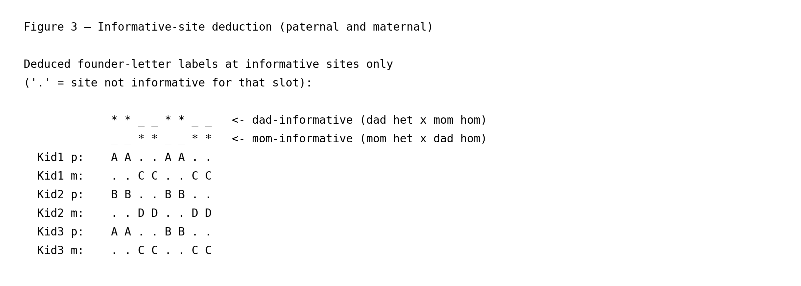

# Structural haplotype mapping in a nuclear family

This page is part of the [wiki](../index.md) and walks through
`gtg-ped-map`'s structural labelling algorithm on the simplest possible
pedigree: a two-generation nuclear family with two founders (dad and
mom) and three children. It complements the full
[`methods.md`](../methods.md) write-up by zooming in on the per-site
mechanics and pinning each figure to the exact Rust code that implements
it. All line numbers refer to commit `c3a7f01`. Each function link is
followed by its call site in the driver — `main()` in
[`map_builder.rs`](https://github.com/Platinum-Pedigree-Consortium/Platinum-Pedigree-Inheritance/blob/c3a7f01d30f061776c3a40163f0b951646edc75e/code/rust/src/bin/map_builder.rs#L989) for `gtg-ped-map`, and `main()` in
[`gtg_concordance.rs`](https://github.com/Platinum-Pedigree-Consortium/Platinum-Pedigree-Inheritance/blob/c3a7f01d30f061776c3a40163f0b951646edc75e/code/rust/src/bin/gtg_concordance.rs#L315) for `gtg-concordance` —
so you can step through the driver source in parallel with this
walkthrough.

The toy simulation hard-codes four founder haplotypes over
9 sites and three children whose transmissions are known a
priori. Everything below is reproducible by running

```
python wiki/generate_wiki.py --page nuclear_family
```

which regenerates both the figure PNGs referenced here and this markdown
file itself.

## 1. Ground truth


Dad carries two physical homologs, named **α** and **β** here purely as
labels for the figure; mom carries **γ** and **δ**. We use Greek
letters at this stage to emphasise that these names refer to specific
*physical homologs* in the founders' cells. The Latin labels (`A`,
`B`, `C`, `D`) that `gtg-ped-map` eventually writes are something
different: they are *per-site, per-block* algorithm tags. The
phrase has two stages, both relevant downstream:

- **Per-site** refers to the raw output of `track_alleles_through_pedigree`
  + `backfill_sibs` described in §3, which runs once per VCF record:
  every site independently picks which of the parent's two letters
  goes to the carrier group (always the *first* letter of the pair),
  so the same kid can be tagged `A` at one site and `B` at the next
  even though it inherited the same physical homolog. Figure 3 makes
  this visible in Kid2's paternal row.
- **Per-block** refers to what survives after `perform_flips_in_place`
  + block collapse in §4, which is what `gtg-ped-map` actually writes
  to disk: each contiguous block of sites that share the same
  partition gets one fixed, self-consistent labeling — but the block
  as a whole can still be flipped `A`↔`B` without losing any
  structural information, because the two letters in a founder's pair
  are interchangeable within any single block. That residual
  per-block freedom is what `gtg-concordance` resolves later by
  enumerating `2^F` founder-phase orientations and picking the one
  that best matches the observed alleles.

In neither stage are Latin letters pinned to a specific physical
homolog by `gtg-ped-map` itself, so it is a recurring source of
confusion to read `A` as a fixed name for dad's `α` homolog; it is
not.

In this simulation:

- **Kid1** inherits `(α, γ)` with no recombination.
- **Kid2** inherits `(β, δ)` with no recombination.
- **Kid3** inherits `(α|β, γ)` — the paternal slot crosses over between
  sites 3 and 4, so Kid3 carries dad's `α` homolog on sites 0–3 and
  dad's `β` homolog on sites 4–8.

At program startup, [`Iht::new`](https://github.com/Platinum-Pedigree-Consortium/Platinum-Pedigree-Inheritance/blob/c3a7f01d30f061776c3a40163f0b951646edc75e/code/rust/src/iht.rs#L172) (driver calls at
[`map_builder.rs:1059`](https://github.com/Platinum-Pedigree-Consortium/Platinum-Pedigree-Inheritance/blob/c3a7f01d30f061776c3a40163f0b951646edc75e/code/rust/src/bin/map_builder.rs#L1059) for the master template
and [`map_builder.rs:1111`](https://github.com/Platinum-Pedigree-Consortium/Platinum-Pedigree-Inheritance/blob/c3a7f01d30f061776c3a40163f0b951646edc75e/code/rust/src/bin/map_builder.rs#L1111) for each VCF site)
hands each founder a fresh pair of Latin letters — `(A,B)`, `(C,D)`,
`(E,F)`, … — *without* associating any allele or any physical homolog
with them. The letters are pure structural placeholders. The two
`Iht::new` call sites play different roles: the first builds a
**master template** that is never mutated — only its
[`legend()`](https://github.com/Platinum-Pedigree-Consortium/Platinum-Pedigree-Inheritance/blob/c3a7f01d30f061776c3a40163f0b951646edc75e/code/rust/src/iht.rs#L330) is read, to print the column header
(`Dad:A|B Mom:C|D Kid1:?|? …`) at the top of the output files. The
second allocates a fresh `local_iht` per VCF record that
[`track_alleles_through_pedigree`](https://github.com/Platinum-Pedigree-Consortium/Platinum-Pedigree-Inheritance/blob/c3a7f01d30f061776c3a40163f0b951646edc75e/code/rust/src/bin/map_builder.rs#L295) then *mutates*
in place to record which founder letter each child inherited at that
site. A per-site copy is needed rather than reusing the master because
(i) each site's IHT vector is itself an output, so it cannot be shared
across sites, and (ii) the master is hard-coded to
`ChromType::Autosome`, whereas `local_iht` uses the chromosome's
actual zygosity (autosome vs. chrX, decided at
[`map_builder.rs:1086`](https://github.com/Platinum-Pedigree-Consortium/Platinum-Pedigree-Inheritance/blob/c3a7f01d30f061776c3a40163f0b951646edc75e/code/rust/src/bin/map_builder.rs#L1086)), which changes how
letters are laid out for males on chrX.

The goal of `gtg-ped-map` is to recover exactly the Greek-labelled
transmissions above — but expressed in Latin letters and only as
*partitions* of the children, not as physical-homolog identities —
from the jointly-called *unphased* VCF alone (see §2), without ever
looking at the underlying 0/1 allele sequence.

## 2. Unphased VCF input


This is the only genotype information `gtg-ped-map` sees (plus the PED
file that declares who is whose parent). Two observations matter:

- **Haplotypes cannot be distinguished from genotypes alone.** A `0/1`
  call for dad does not reveal which of his two homologs carries the
  `1`, so a single-individual view has no way to label `A` vs `B`.
- **Patterns across the family resolve the ambiguity.** If dad is `0/1`
  while mom is `0/0`, then any child that also carries a `1` must have
  inherited dad's `1`-carrying homolog — precisely the logic of the
  informative-site test in the next section.

Only biallelic SNVs enter the map; indels are filtered at read time via
[`is_indel`](https://github.com/Platinum-Pedigree-Consortium/Platinum-Pedigree-Inheritance/blob/c3a7f01d30f061776c3a40163f0b951646edc75e/code/rust/src/bin/map_builder.rs#L501), invoked from the VCF-reading loop at
[`map_builder.rs:164`](https://github.com/Platinum-Pedigree-Consortium/Platinum-Pedigree-Inheritance/blob/c3a7f01d30f061776c3a40163f0b951646edc75e/code/rust/src/bin/map_builder.rs#L164) inside `parse_vcf` (the
driver calls `parse_vcf` at [`map_builder.rs:1092`](https://github.com/Platinum-Pedigree-Consortium/Platinum-Pedigree-Inheritance/blob/c3a7f01d30f061776c3a40163f0b951646edc75e/code/rust/src/bin/map_builder.rs#L1092)).

## 3. Informative-site detection, letter tagging, and sibling backfill



This section describes what `gtg-ped-map` does at *each VCF record
independently*. The two routines involved —
[`track_alleles_through_pedigree`](https://github.com/Platinum-Pedigree-Consortium/Platinum-Pedigree-Inheritance/blob/c3a7f01d30f061776c3a40163f0b951646edc75e/code/rust/src/bin/map_builder.rs#L295) (driver call at
[`map_builder.rs:1116`](https://github.com/Platinum-Pedigree-Consortium/Platinum-Pedigree-Inheritance/blob/c3a7f01d30f061776c3a40163f0b951646edc75e/code/rust/src/bin/map_builder.rs#L1116)) and
[`backfill_sibs`](https://github.com/Platinum-Pedigree-Consortium/Platinum-Pedigree-Inheritance/blob/c3a7f01d30f061776c3a40163f0b951646edc75e/code/rust/src/bin/map_builder.rs#L804) (driver call at
[`map_builder.rs:1122`](https://github.com/Platinum-Pedigree-Consortium/Platinum-Pedigree-Inheritance/blob/c3a7f01d30f061776c3a40163f0b951646edc75e/code/rust/src/bin/map_builder.rs#L1122)) — are called once per
site, and produce the per-site Latin labels rendered in Figure 3. No
across-site reasoning has happened yet at this stage.

**Step 1 — informative-site detection.**
[`track_alleles_through_pedigree`](https://github.com/Platinum-Pedigree-Consortium/Platinum-Pedigree-Inheritance/blob/c3a7f01d30f061776c3a40163f0b951646edc75e/code/rust/src/bin/map_builder.rs#L295) walks the
pedigree in ancestor-first depth order and, for every
`(parent, spouse)` pair, calls
[`unique_allele`](https://github.com/Platinum-Pedigree-Consortium/Platinum-Pedigree-Inheritance/blob/c3a7f01d30f061776c3a40163f0b951646edc75e/code/rust/src/bin/map_builder.rs#L243) (from inside the walk at
[`map_builder.rs:315`](https://github.com/Platinum-Pedigree-Consortium/Platinum-Pedigree-Inheritance/blob/c3a7f01d30f061776c3a40163f0b951646edc75e/code/rust/src/bin/map_builder.rs#L315)) to ask whether the parent
carries an allele that the spouse does not. Two cases can arise:

- **Dad-informative** (dad het × mom hom): dad's unique allele tags
  whichever paternal homolog each child inherited. In this simulation
  these are sites `[0, 1, 4, 5, 8]`.
- **Mom-informative** (mom het × dad hom): symmetric, tagging the
  child's maternal slot. These are sites `[2, 3, 6, 7]`.

**Step 2 — tag carriers with the first letter.** At an informative
site the parent has two distinct alleles, exactly one of which is
*unique* to that parent (i.e. absent from the spouse). The
operational test for each child is then a single allele lookup at
that site: does the child's genotype contain the parent's unique
allele, yes or no? Define a child to be a **carrier** (of the
parent's unique allele, at this site) iff the answer is yes. If the
child is a carrier, it must have inherited the parental homolog that
carries the unique allele (since the spouse could not have donated
it); if not, the child must have inherited the parent's *other*
homolog (the one carrying the allele common to both parents). So the
children are partitioned into two groups by the carrier test. The
two letters of the parent's pair are handed out one per group, but
`track_alleles_through_pedigree` only writes a letter to the carrier
group: it always picks the *first* letter of the parent's pair (`A`
for dad-informative sites, `C` for mom-informative sites,
[`map_builder.rs:333`](https://github.com/Platinum-Pedigree-Consortium/Platinum-Pedigree-Inheritance/blob/c3a7f01d30f061776c3a40163f0b951646edc75e/code/rust/src/bin/map_builder.rs#L333)) and writes it to every
carrier; the non-carriers are left as `?` and resolved in Step 3.

This per-site choice of "first letter to carriers" is arbitrary in
two senses. First, the parent's `(A, B)` pair was created at startup
with no physical-homolog identity attached. Second, the *carrier
group* itself is defined by whichever physical homolog happens to
carry the unique allele at that particular site, and that can flip
between sites. So the same kid can be tagged `A` at one site and `B`
at the next while the underlying transmission is unchanged — these
are independent draws of an arbitrary label, not real switches. The
IHT therefore records the *partition* (which kids inherited the same
parental homolog) reliably, but identifying `A` with one specific
physical homolog is a per-site, per-block free choice that downstream
code (`perform_flips_in_place`, see §4, and ultimately
`gtg-concordance`'s `2^F`-orientation enumeration) is responsible for
reconciling.

**Step 3 — sibling backfill.**
[`backfill_sibs`](https://github.com/Platinum-Pedigree-Consortium/Platinum-Pedigree-Inheritance/blob/c3a7f01d30f061776c3a40163f0b951646edc75e/code/rust/src/bin/map_builder.rs#L804) is then called for the same
site. It exploits the fact that across siblings, both founder
homologs must be represented somewhere (when a parent has more than
one child). Concretely, it does three things per parent per site:

1. **Backfill non-carriers.** For every sibling left as `?` after
   Step 2, write the parent's *other* letter (`B` for dad, `D` for
   mom). This works whether the sibling was a known non-carrier or
   had a *missing genotype* — the latter is recovered purely by
   sibling elimination, since once carriers are identified and only
   one founder homolog remains, that homolog must have gone to the
   untagged child. Site 8 in Figure 3 shows this case: Kid1's
   genotype is `./.` in the VCF, so Step 2 cannot tag it, but Kid2
   and Kid3 are tagged carriers (`A`), so backfill assigns Kid1 the
   other letter (`B`).
2. **Swap by majority** ([`map_builder.rs:881`](https://github.com/Platinum-Pedigree-Consortium/Platinum-Pedigree-Inheritance/blob/c3a7f01d30f061776c3a40163f0b951646edc75e/code/rust/src/bin/map_builder.rs#L881)).
   After backfilling, count how many sibling slots carry each of the
   two letters. If the letter assigned to carriers (`A` or `C`) ends
   up in the *minority*, swap the two letters across all siblings so
   the majority class always carries the first letter. This is a
   deterministic per-site convention so that two sites whose carrier
   groups happen to be *the same set of kids* — but where one site
   has a 2-carrier majority and the other a 1-carrier minority —
   nevertheless emerge with consistent labels, simplifying later
   block reconciliation.
3. **Skip families with one child** (the `children.len() > 1` guard
   at [`map_builder.rs:818`](https://github.com/Platinum-Pedigree-Consortium/Platinum-Pedigree-Inheritance/blob/c3a7f01d30f061776c3a40163f0b951646edc75e/code/rust/src/bin/map_builder.rs#L818)), where there is no
   second sibling to provide the elimination signal.

Because the depth-ordered walk in Step 1 always processes a parent
before its children, [`get_iht_markers`](https://github.com/Platinum-Pedigree-Consortium/Platinum-Pedigree-Inheritance/blob/c3a7f01d30f061776c3a40163f0b951646edc75e/code/rust/src/bin/map_builder.rs#L274) (called
from inside the walk at [`map_builder.rs:328`](https://github.com/Platinum-Pedigree-Consortium/Platinum-Pedigree-Inheritance/blob/c3a7f01d30f061776c3a40163f0b951646edc75e/code/rust/src/bin/map_builder.rs#L328))
reads the parent's already-assigned letters when propagating to the
next generation, which is what makes the method look "recursive"
across generations while being expressed as a single loop.

Non-informative sites (both parents het, or both hom for the same
allele) contribute nothing at this stage and are rendered as `.` in
Figure 3. The two indicator rows (`*` marks informative sites, `_`
marks non-informative ones) sit directly above the kid rows, with
every column aligned, so you can read each letter assignment straight
up to the indicator that produced it. Each kid's paternal row (`p`)
sits directly above its maternal row (`m`). Notice in Figure 3 that
Kid2's paternal row is *not* a uniform run of one letter even though
Kid2 inherits the same physical homolog (`β`) at every dad-informative
site: the per-site `A`/`B` assignment shifts as the carrier group and
its majority shift across sites. That apparent letter switching is
the per-site arbitrariness described in Step 2 — it is not a real
recombination signal, and §4's flip pass is what reconciles it.

## 4. Block collapse, noise filtering, and flip reconciliation


The per-site labels in Figure 3 are correct as *partitions* of the
children but, as flagged in §3, the letter convention can flip from
site to site. Several Rust routines reconcile and clean the trace up
before it is written to disk:

1. [`collapse_identical_iht`](https://github.com/Platinum-Pedigree-Consortium/Platinum-Pedigree-Inheritance/blob/c3a7f01d30f061776c3a40163f0b951646edc75e/code/rust/src/bin/map_builder.rs#L385) (driver call at
   [`map_builder.rs:1191`](https://github.com/Platinum-Pedigree-Consortium/Platinum-Pedigree-Inheritance/blob/c3a7f01d30f061776c3a40163f0b951646edc75e/code/rust/src/bin/map_builder.rs#L1191)) merges adjacent
   sites with compatible letter assignments into blocks, while
   [`fill_missing_values`](https://github.com/Platinum-Pedigree-Consortium/Platinum-Pedigree-Inheritance/blob/c3a7f01d30f061776c3a40163f0b951646edc75e/code/rust/src/bin/map_builder.rs#L617) (driver call at
   [`map_builder.rs:1200`](https://github.com/Platinum-Pedigree-Consortium/Platinum-Pedigree-Inheritance/blob/c3a7f01d30f061776c3a40163f0b951646edc75e/code/rust/src/bin/map_builder.rs#L1200)) and
   [`fill_missing_values_by_neighbor`](https://github.com/Platinum-Pedigree-Consortium/Platinum-Pedigree-Inheritance/blob/c3a7f01d30f061776c3a40163f0b951646edc75e/code/rust/src/bin/map_builder.rs#L540) (driver
   call at [`map_builder.rs:1201`](https://github.com/Platinum-Pedigree-Consortium/Platinum-Pedigree-Inheritance/blob/c3a7f01d30f061776c3a40163f0b951646edc75e/code/rust/src/bin/map_builder.rs#L1201)) fill the
   `.` gaps visible in Figure 3 from flanking blocks.
2. [`count_matching_neighbors`](https://github.com/Platinum-Pedigree-Consortium/Platinum-Pedigree-Inheritance/blob/c3a7f01d30f061776c3a40163f0b951646edc75e/code/rust/src/bin/map_builder.rs#L935) (driver call at
   [`map_builder.rs:1172`](https://github.com/Platinum-Pedigree-Consortium/Platinum-Pedigree-Inheritance/blob/c3a7f01d30f061776c3a40163f0b951646edc75e/code/rust/src/bin/map_builder.rs#L1172)) and
   [`mask_child_alleles`](https://github.com/Platinum-Pedigree-Consortium/Platinum-Pedigree-Inheritance/blob/c3a7f01d30f061776c3a40163f0b951646edc75e/code/rust/src/bin/map_builder.rs#L970) (driver call at
   [`map_builder.rs:1187`](https://github.com/Platinum-Pedigree-Consortium/Platinum-Pedigree-Inheritance/blob/c3a7f01d30f061776c3a40163f0b951646edc75e/code/rust/src/bin/map_builder.rs#L1187)) identify isolated
   runs shorter than `--run` (default 10 markers) and mask them back
   to `?` as likely sequencing noise, so that collapse does not
   invent spurious recombinations.
3. [`perform_flips_in_place`](https://github.com/Platinum-Pedigree-Consortium/Platinum-Pedigree-Inheritance/blob/c3a7f01d30f061776c3a40163f0b951646edc75e/code/rust/src/bin/map_builder.rs#L702) enforces a
   consistent founder-letter orientation across blocks, since the
   two letters in a founder's pair are interchangeable within any
   single block. This is the routine that finally pins each block's
   `A`/`B` (or `C`/`D`) convention so that consecutive blocks agree
   on every kid that did *not* recombine. The driver calls it three
   times — before and after block collapse, and again after gap
   fill — at
   [`map_builder.rs:1135`](https://github.com/Platinum-Pedigree-Consortium/Platinum-Pedigree-Inheritance/blob/c3a7f01d30f061776c3a40163f0b951646edc75e/code/rust/src/bin/map_builder.rs#L1135),
   [`map_builder.rs:1193`](https://github.com/Platinum-Pedigree-Consortium/Platinum-Pedigree-Inheritance/blob/c3a7f01d30f061776c3a40163f0b951646edc75e/code/rust/src/bin/map_builder.rs#L1193), and
   [`map_builder.rs:1203`](https://github.com/Platinum-Pedigree-Consortium/Platinum-Pedigree-Inheritance/blob/c3a7f01d30f061776c3a40163f0b951646edc75e/code/rust/src/bin/map_builder.rs#L1203).

After these steps, each kid's paternal and maternal slots are fully
resolved — shown on separate rows per kid in Figure 4. Within each
block all three kids' labels agree on a single partition; across
adjacent blocks, only the kid(s) that genuinely recombined change
letter. Kid3's highlighted `A`→`B` transition on the paternal row is
emitted to `{prefix}.recombinants.txt` by
[`summarize_child_changes`](https://github.com/Platinum-Pedigree-Consortium/Platinum-Pedigree-Inheritance/blob/c3a7f01d30f061776c3a40163f0b951646edc75e/code/rust/src/bin/map_builder.rs#L673) (driver call at
[`map_builder.rs:1228`](https://github.com/Platinum-Pedigree-Consortium/Platinum-Pedigree-Inheritance/blob/c3a7f01d30f061776c3a40163f0b951646edc75e/code/rust/src/bin/map_builder.rs#L1228)).

## 5. Truth versus deduced


The truth row uses Greek (physical homologs); the deduced row uses
Latin (per-block algorithm letters). They cannot be compared
character-by-character because, as discussed in §3 and §4, the
algorithm guarantees the *partition* of children at each site — not
which physical homolog each Latin letter corresponds to. Two
labelings are therefore counted as agreeing at a site iff they induce
the same partition of the three children: for every kid pair `(i,j)`,
truth and deduced agree on whether kid *i* and kid *j* share a
homolog. By that criterion the deduced trace matches the ground truth
at every site (0 partition mismatches out of
18 partition slots = paternal + maternal per site),
including Kid3's recombination at sites 3/4.

The full output of `gtg-ped-map` for this chromosome is the set of
blocks shown above plus the `recombinants.txt` entry for Kid3's
switch — and critically, **nothing else**. The block map stores only
founder letters; it does *not* store the 0/1 allele sequence of any
haplotype.

Reconstructing which allele each letter represents at every VCF site
is the job of `gtg-concordance`, which will have its own wiki page
once migrated. For every block, `gtg-concordance` enumerates the
`2^F` founder-phase orientations produced by
[`Iht::founder_phase_orientations`](https://github.com/Platinum-Pedigree-Consortium/Platinum-Pedigree-Inheritance/blob/c3a7f01d30f061776c3a40163f0b951646edc75e/code/rust/src/iht.rs#L492) (driver call
at [`gtg_concordance.rs:256`](https://github.com/Platinum-Pedigree-Consortium/Platinum-Pedigree-Inheritance/blob/c3a7f01d30f061776c3a40163f0b951646edc75e/code/rust/src/bin/gtg_concordance.rs#L256)), maps letters
to VCF alleles via [`assign_genotypes`](https://github.com/Platinum-Pedigree-Consortium/Platinum-Pedigree-Inheritance/blob/c3a7f01d30f061776c3a40163f0b951646edc75e/code/rust/src/iht.rs#L442) (driver
call at [`gtg_concordance.rs:267`](https://github.com/Platinum-Pedigree-Consortium/Platinum-Pedigree-Inheritance/blob/c3a7f01d30f061776c3a40163f0b951646edc75e/code/rust/src/bin/gtg_concordance.rs#L267)), and
picks the orientation that minimises mismatches against the observed
genotypes. The split of responsibilities is deliberate and strict:
`gtg-ped-map` writes only letters and only at informative sites, while
`gtg-concordance` is the sole place where letter→allele correspondence
is computed and written out.
