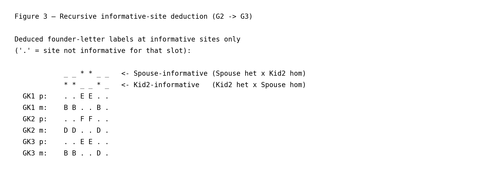

# Extending the same pass to a third generation

This page is part of the [wiki](../index.md) and extends the
[nuclear-family walkthrough](../nuclear_family/nuclear_family.md) by
adding an outside marriage to Kid2 and a third-generation sibship. The
point is that `gtg-ped-map` handles G2→G3 with the **same single loop**
it used for G1→G2, without ever constructing a joint inheritance vector
across all founders. All line numbers refer to commit `2acfb8b`. As
in the nuclear-family page, each function link is followed by its call
site in the driver — `main()` in
[`map_builder.rs`](https://github.com/Platinum-Pedigree-Consortium/Platinum-Pedigree-Inheritance/blob/2acfb8b0e9dadbcd707e9adbf1a546ef91ff145e/code/rust/src/bin/map_builder.rs#L989) — so you can step through the
driver source in parallel with this walkthrough.

The toy simulation adds two things on top of the nuclear-family example:

- Kid2 marries **Spouse**, a fresh founder whose two homologs are
  labelled **E** and **F** by [`Iht::new`](https://github.com/Platinum-Pedigree-Consortium/Platinum-Pedigree-Inheritance/blob/2acfb8b0e9dadbcd707e9adbf1a546ef91ff145e/code/rust/src/iht.rs#L172) (driver
  calls at [`map_builder.rs:1059`](https://github.com/Platinum-Pedigree-Consortium/Platinum-Pedigree-Inheritance/blob/2acfb8b0e9dadbcd707e9adbf1a546ef91ff145e/code/rust/src/bin/map_builder.rs#L1059) for the master
  template and [`map_builder.rs:1111`](https://github.com/Platinum-Pedigree-Consortium/Platinum-Pedigree-Inheritance/blob/2acfb8b0e9dadbcd707e9adbf1a546ef91ff145e/code/rust/src/bin/map_builder.rs#L1111) for each
  VCF site).
- The couple has three grandchildren — GK1, GK2, GK3 — over
  6 VCF sites, with one maternal crossover in GK3.

Everything below is reproducible by running

```
python wiki/generate_wiki.py --page three_generations
```

which regenerates both the figure PNGs referenced here and this
markdown file itself.

## 1. Pedigree with outside marriage


Kid2 arrives at this pass already labelled `(B, D)` — the result of the
G1→G2 informative-site deduction walked through in the nuclear-family
page. She is not a founder of the three-generation pedigree, but from
the perspective of the G2→G3 sub-problem she plays exactly the role
Dad and Mom played in G1→G2: her two homologs are already tagged with
letters, and those letters are what `gtg-ped-map` will propagate to
GK1, GK2, GK3.

Spouse, on the other hand, *is* a founder relative to this pedigree
branch, so [`Iht::new`](https://github.com/Platinum-Pedigree-Consortium/Platinum-Pedigree-Inheritance/blob/2acfb8b0e9dadbcd707e9adbf1a546ef91ff145e/code/rust/src/iht.rs#L172) (called from the driver
at [`map_builder.rs:1059`](https://github.com/Platinum-Pedigree-Consortium/Platinum-Pedigree-Inheritance/blob/2acfb8b0e9dadbcd707e9adbf1a546ef91ff145e/code/rust/src/bin/map_builder.rs#L1059) and
[`map_builder.rs:1111`](https://github.com/Platinum-Pedigree-Consortium/Platinum-Pedigree-Inheritance/blob/2acfb8b0e9dadbcd707e9adbf1a546ef91ff145e/code/rust/src/bin/map_builder.rs#L1111)) hands him the next
fresh letter pair `(E, F)`. Nothing about Spouse depends on the G1 pass.

## 2. Unphased VCF rows for the G2→G3 pass


These are the only genotype rows the tool sees for the new nuclear
unit. Kid2's row here is exactly the same row she had in the
nuclear-family page — but now it is read with Kid2 in the **parent**
role. That is the key structural point: `gtg-ped-map` does not treat
G1 and G2 individuals differently; it just iterates over
(parent, spouse, child) triples in ancestor-first depth order given by
`family.get_individual_depths()` (see
[`ped.rs`](https://github.com/Platinum-Pedigree-Consortium/Platinum-Pedigree-Inheritance/blob/2acfb8b0e9dadbcd707e9adbf1a546ef91ff145e/code/rust/src/ped.rs)).

## 3. Recursive informative-site deduction



The exact same function,
[`track_alleles_through_pedigree`](https://github.com/Platinum-Pedigree-Consortium/Platinum-Pedigree-Inheritance/blob/2acfb8b0e9dadbcd707e9adbf1a546ef91ff145e/code/rust/src/bin/map_builder.rs#L295) (driver call at
[`map_builder.rs:1116`](https://github.com/Platinum-Pedigree-Consortium/Platinum-Pedigree-Inheritance/blob/2acfb8b0e9dadbcd707e9adbf1a546ef91ff145e/code/rust/src/bin/map_builder.rs#L1116)), that handled G1→G2 now
handles G2→G3. For each (parent, spouse) pair it calls
[`unique_allele`](https://github.com/Platinum-Pedigree-Consortium/Platinum-Pedigree-Inheritance/blob/2acfb8b0e9dadbcd707e9adbf1a546ef91ff145e/code/rust/src/bin/map_builder.rs#L243) (invoked from inside the walk
at [`map_builder.rs:315`](https://github.com/Platinum-Pedigree-Consortium/Platinum-Pedigree-Inheritance/blob/2acfb8b0e9dadbcd707e9adbf1a546ef91ff145e/code/rust/src/bin/map_builder.rs#L315)) to find alleles that
one partner carries and the other does not:

- **Spouse-informative** (Spouse het × Kid2 hom): the unique paternal
  allele tags whichever Spouse homolog (`E` or `F`) each grandchild
  inherited. In this simulation these are sites `[2, 3]`.
- **Kid2-informative** (Kid2 het × Spouse hom): symmetric, tagging `B`
  or `D`. These are sites `[0, 1, 4]`.

When the walk reaches the Kid2–Spouse pair,
[`get_iht_markers`](https://github.com/Platinum-Pedigree-Consortium/Platinum-Pedigree-Inheritance/blob/2acfb8b0e9dadbcd707e9adbf1a546ef91ff145e/code/rust/src/bin/map_builder.rs#L274) (called from inside the walk
at [`map_builder.rs:328`](https://github.com/Platinum-Pedigree-Consortium/Platinum-Pedigree-Inheritance/blob/2acfb8b0e9dadbcd707e9adbf1a546ef91ff145e/code/rust/src/bin/map_builder.rs#L328)) reads Kid2's
already-assigned `(B, D)` letters directly — those labels were written
during the earlier G1→G2 iteration of the same loop. That is what makes the
algorithm look recursive across generations even though it is a single
ancestor-first pass: by the time the loop reaches a G2 parent, her
letter labels are already finalized and they serve as the "founder
labels" for the G2→G3 sub-problem. No joint inheritance vector over
all six founders `{A, B, C, D, E, F}` is ever constructed; each
grandkid ends with exactly two letters — one per homolog — identical
in shape to the output of the nuclear-family pass.

Figure 3 keeps the same layout as the nuclear-family analogue: the two
indicator rows (`*` marks informative sites, `_` non-informative ones)
sit above the grandkid rows, each grandkid's paternal row (`p`) is
placed directly above its maternal row (`m`), and every column is
aligned so you can read each letter assignment straight up to the
indicator that produced it.

## 4. Block collapse and G2→G3 recombination


The same block-collapse, gap-fill and flip routines invoked for G1→G2 —
[`collapse_identical_iht`](https://github.com/Platinum-Pedigree-Consortium/Platinum-Pedigree-Inheritance/blob/2acfb8b0e9dadbcd707e9adbf1a546ef91ff145e/code/rust/src/bin/map_builder.rs#L385) (driver call at
[`map_builder.rs:1191`](https://github.com/Platinum-Pedigree-Consortium/Platinum-Pedigree-Inheritance/blob/2acfb8b0e9dadbcd707e9adbf1a546ef91ff145e/code/rust/src/bin/map_builder.rs#L1191)),
[`fill_missing_values`](https://github.com/Platinum-Pedigree-Consortium/Platinum-Pedigree-Inheritance/blob/2acfb8b0e9dadbcd707e9adbf1a546ef91ff145e/code/rust/src/bin/map_builder.rs#L617) (driver call at
[`map_builder.rs:1200`](https://github.com/Platinum-Pedigree-Consortium/Platinum-Pedigree-Inheritance/blob/2acfb8b0e9dadbcd707e9adbf1a546ef91ff145e/code/rust/src/bin/map_builder.rs#L1200)),
[`fill_missing_values_by_neighbor`](https://github.com/Platinum-Pedigree-Consortium/Platinum-Pedigree-Inheritance/blob/2acfb8b0e9dadbcd707e9adbf1a546ef91ff145e/code/rust/src/bin/map_builder.rs#L540) (driver call
at [`map_builder.rs:1201`](https://github.com/Platinum-Pedigree-Consortium/Platinum-Pedigree-Inheritance/blob/2acfb8b0e9dadbcd707e9adbf1a546ef91ff145e/code/rust/src/bin/map_builder.rs#L1201)), and
[`perform_flips_in_place`](https://github.com/Platinum-Pedigree-Consortium/Platinum-Pedigree-Inheritance/blob/2acfb8b0e9dadbcd707e9adbf1a546ef91ff145e/code/rust/src/bin/map_builder.rs#L702) (driver calls at
[`map_builder.rs:1135`](https://github.com/Platinum-Pedigree-Consortium/Platinum-Pedigree-Inheritance/blob/2acfb8b0e9dadbcd707e9adbf1a546ef91ff145e/code/rust/src/bin/map_builder.rs#L1135),
[`map_builder.rs:1193`](https://github.com/Platinum-Pedigree-Consortium/Platinum-Pedigree-Inheritance/blob/2acfb8b0e9dadbcd707e9adbf1a546ef91ff145e/code/rust/src/bin/map_builder.rs#L1193), and
[`map_builder.rs:1203`](https://github.com/Platinum-Pedigree-Consortium/Platinum-Pedigree-Inheritance/blob/2acfb8b0e9dadbcd707e9adbf1a546ef91ff145e/code/rust/src/bin/map_builder.rs#L1203)) — run on the G3 trace
without modification. GK3's `m` row switches `B → D` between sites 3
and 4, reflecting a crossover in Kid2's gametogenesis, and is emitted
to `{prefix}.recombinants.txt` by
[`summarize_child_changes`](https://github.com/Platinum-Pedigree-Consortium/Platinum-Pedigree-Inheritance/blob/2acfb8b0e9dadbcd707e9adbf1a546ef91ff145e/code/rust/src/bin/map_builder.rs#L673) (driver call at
[`map_builder.rs:1228`](https://github.com/Platinum-Pedigree-Consortium/Platinum-Pedigree-Inheritance/blob/2acfb8b0e9dadbcd707e9adbf1a546ef91ff145e/code/rust/src/bin/map_builder.rs#L1228)). Note that GK3's
paternal row is a flat `E` block: this particular crossover is
maternal, not paternal, because it happened in the meiosis that
produced GK3's Kid2-derived gamete.

## 5. Truth versus deduced


For every grandkid the deduced paternal and maternal label streams
match the ground truth at every site (0 mismatches out of
36 label slots), including GK3's maternal recombination.
The block map stored for G3 uses only the letters `{B, D, E, F}` —
there is no slot for `A` or `C`, because neither reached G3 (Kid2
carried only `B` and `D` into this meiosis). As in the nuclear-family
case, the block map contains only founder letters; the 0/1 allele
sequence of each haplotype is reconstructed downstream by
`gtg-concordance`, which will have its own wiki page once migrated.
