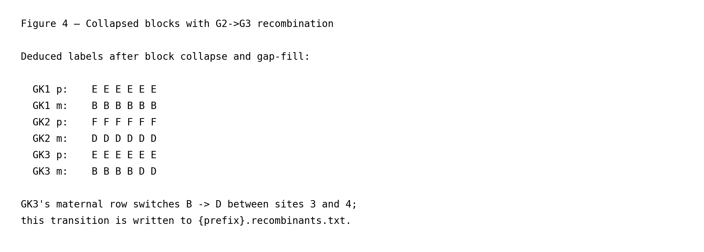
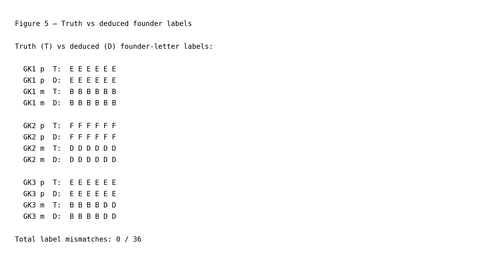
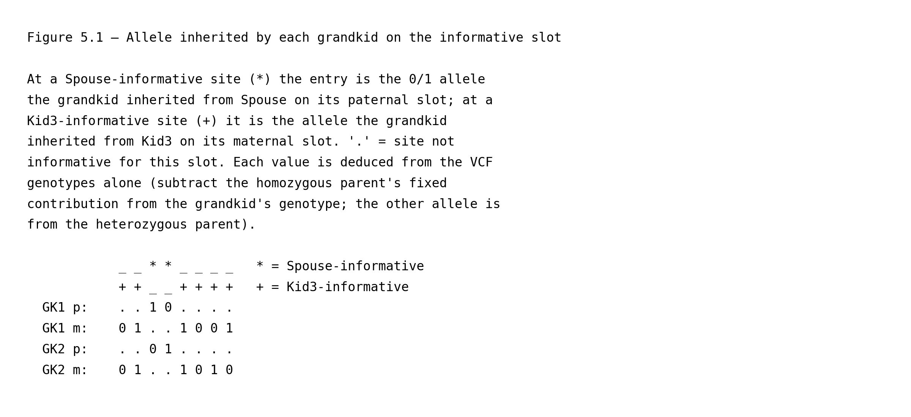
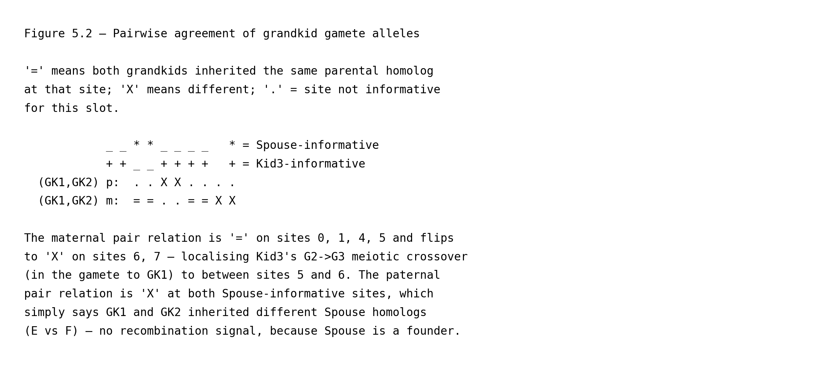
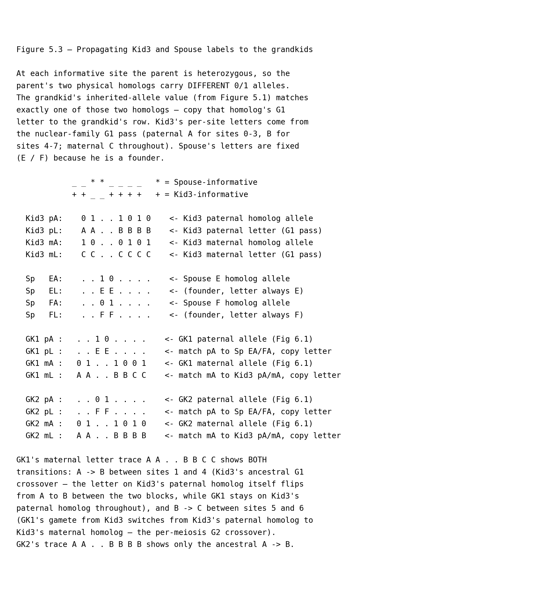

# Structural haplotype mapping across three generations

This page is part of the [wiki](../index.md) and extends the
[nuclear-family walkthrough](../nuclear_family/nuclear_family.md) by
marrying **Kid3** — the paternal recombinant from that page — to an
outside-marriage founder **Spouse** and adding two grandchildren
**GK1** and **GK2**. The point is not to re-run the per-site
mechanics from §3-4 of the nuclear-family page, which generalise
verbatim and are not repeated, but to elaborate two things that only
become visible once a third generation is in the pedigree:

1. `gtg-ped-map` does not have a separate "G2→G3 pass" bolted on top
   of a G1→G2 pass. The *one* operation on the nuclear-family page
   that really is a walk over the pedigree —
   [`track_alleles_through_pedigree`](https://github.com/Platinum-Pedigree-Consortium/Platinum-Pedigree-Inheritance/blob/f9c19ae42b7bae62bfd1e880024069c5e6b6eb67/code/rust/src/bin/map_builder.rs#L295), which
   performs [Step 1](../nuclear_family/nuclear_family.md#3-informative-site-detection-founder-letter-tagging-and-haplotype-inference-within-a-linkage-block)
   (flag, per (parent, spouse, child) triple, the sites at which the
   parent is heterozygous and the spouse is homozygous — the sites
   where the parent's two alleles are distinguishable in the
   children) and [Step 2](../nuclear_family/nuclear_family.md#3-informative-site-detection-founder-letter-tagging-and-haplotype-inference-within-a-linkage-block)
   (at each such site, write one of the parent's two letters onto
   whichever child-homolog carries the parent's unique allele) —
   is **a single ancestor-first walk** that considers G1, G2 and G3
   together, iterating over (parent, spouse, child) triples in
   **depth order** — an ordering that processes founders first,
   then their children, then their grandchildren, so that a
   non-founder parent's letters are always in place before she is
   asked to play the parent role in a later triple (§2 gives the
   precise definition and this pedigree's depth assignments). For
   this pedigree the walk visits two triples back-to-back, and by
   the time it reaches the second triple the G2 parent's letters
   have already been written into her slot pair — so they serve as
   "parent letters" for the G3 sub-problem without any special
   casing.

   It is worth emphasising that the rest of the nuclear-family
   pipeline is **not** part of this walk. Sibship backfilling
   ([`backfill_sibs`](https://github.com/Platinum-Pedigree-Consortium/Platinum-Pedigree-Inheritance/blob/f9c19ae42b7bae62bfd1e880024069c5e6b6eb67/code/rust/src/bin/map_builder.rs#L804)) runs once per VCF
   record at the whole-family level, right after the walk, consuming
   its output. The flip pass
   ([`perform_flips_in_place`](https://github.com/Platinum-Pedigree-Consortium/Platinum-Pedigree-Inheritance/blob/f9c19ae42b7bae62bfd1e880024069c5e6b6eb67/code/rust/src/bin/map_builder.rs#L702)), block collapse
   ([`collapse_identical_iht`](https://github.com/Platinum-Pedigree-Consortium/Platinum-Pedigree-Inheritance/blob/f9c19ae42b7bae62bfd1e880024069c5e6b6eb67/code/rust/src/bin/map_builder.rs#L385)) and gap-fill
   ([`fill_missing_values`](https://github.com/Platinum-Pedigree-Consortium/Platinum-Pedigree-Inheritance/blob/f9c19ae42b7bae62bfd1e880024069c5e6b6eb67/code/rust/src/bin/map_builder.rs#L617) then
   [`fill_missing_values_by_neighbor`](https://github.com/Platinum-Pedigree-Consortium/Platinum-Pedigree-Inheritance/blob/f9c19ae42b7bae62bfd1e880024069c5e6b6eb67/code/rust/src/bin/map_builder.rs#L540)) are
   run later still — in that execution order, with
   `perform_flips_in_place` invoked three times in total, once
   before collapse and again after each gap-fill step — as
   *global passes over the pooled grid of every record × every
   individual*. None of them iterate triples or depths at all. So
   "single ancestor-first walk" describes the letter-assignment step
   specifically — not the full nuclear-family pipeline — and the
   rest of the post-processing simply sees a wider grid (more
   individuals, one more generation) in the G3 case than it did in
   the nuclear-family case.
2. Two qualitatively different kinds of crossover can appear in a
   grandchild's letter trace: an **ancestral** crossover, inherited
   unchanged from one of Kid3's homologs and therefore shared across
   every G3 descendant that inherits the affected segment, versus a
   **de novo** crossover, introduced in Kid3's own meiosis and
   therefore visible in only one grandchild. Telling them apart
   requires two grandchildren, because the diagnostic signature is
   that the ancestral transition appears in *both* while the de novo
   one appears in only *one*.

All line numbers refer to commit `f9c19ae`. As in the other
walkthrough pages, each function link is followed by its call site in
`main()` in [`map_builder.rs`](https://github.com/Platinum-Pedigree-Consortium/Platinum-Pedigree-Inheritance/blob/f9c19ae42b7bae62bfd1e880024069c5e6b6eb67/code/rust/src/bin/map_builder.rs#L989) so you can step
through the driver source in parallel.

The toy simulation spans 8 VCF sites. Everything below
is reproducible by running

```
python wiki/generate_wiki.py --page three_generations
```

which regenerates both the figure PNGs referenced here and this
markdown file itself.

## 1. The extended pedigree


The **G1** layer — `(Dad, Mom) → {Kid1, Kid2, Kid3}` — is exactly
the pedigree the [nuclear-family page](../nuclear_family/nuclear_family.md)
walks through. On this page Kid3 then marries **Spouse**, a fresh
founder, adding the **G2→G3** layer `(Kid3, Spouse) → {GK1, GK2}`.

Kid1 and Kid2 are not drawn in Figure 1, but they are still part
of the pedigree the algorithm processes, and their presence is
load-bearing: the [multi-child guard in
`backfill_sibs`](https://github.com/Platinum-Pedigree-Consortium/Platinum-Pedigree-Inheritance/blob/f9c19ae42b7bae62bfd1e880024069c5e6b6eb67/code/rust/src/bin/map_builder.rs#L818) disables partition inference
for single-child families, so Kid3's `A`/`B` paternal labels and `C`
maternal label exist only because Kid1 and Kid2 anchor the partition
at each G1-informative site. Pulling them out of the pedigree would
leave Kid3's letters undetermined, and with them the whole G2→G3
letter trace.

Transmission in the toy simulation:

- **Kid3** carries Dad's ancestral paternal-homolog crossover from
  the nuclear-family page: paternal slot letter `A` on sites 0–3 and
  `B` on sites 4–7; maternal slot letter `C` throughout.
- **Spouse**, a founder, is handed the fresh letter pair `(E, F)` by
  [`Iht::new`](https://github.com/Platinum-Pedigree-Consortium/Platinum-Pedigree-Inheritance/blob/f9c19ae42b7bae62bfd1e880024069c5e6b6eb67/code/rust/src/iht.rs#L172) (driver calls at
  [`map_builder.rs:1059`](https://github.com/Platinum-Pedigree-Consortium/Platinum-Pedigree-Inheritance/blob/f9c19ae42b7bae62bfd1e880024069c5e6b6eb67/code/rust/src/bin/map_builder.rs#L1059) for the master
  template and [`map_builder.rs:1111`](https://github.com/Platinum-Pedigree-Consortium/Platinum-Pedigree-Inheritance/blob/f9c19ae42b7bae62bfd1e880024069c5e6b6eb67/code/rust/src/bin/map_builder.rs#L1111) per VCF
  site), identically to how Dad and Mom were handed `(A, B)` / `(C, D)`
  at the start of the nuclear-family walkthrough.
- **GK1** inherits Spouse's `E` homolog on the paternal slot, plus a
  Kid3 gamete with a crossover: Kid3's paternal homolog (letters
  `A,A,A,A,B,B`) on sites 0–5, then Kid3's maternal homolog (letter
  `C,C`) on sites 6–7.
- **GK2** inherits Spouse's `F` homolog on the paternal slot, plus
  Kid3's paternal homolog unrecombined (letters `A,A,A,A,B,B,B,B`).

## 2. One ancestor-first walk, two triples

The routine
[`track_alleles_through_pedigree`](https://github.com/Platinum-Pedigree-Consortium/Platinum-Pedigree-Inheritance/blob/f9c19ae42b7bae62bfd1e880024069c5e6b6eb67/code/rust/src/bin/map_builder.rs#L295) (driver call
at [`map_builder.rs:1116`](https://github.com/Platinum-Pedigree-Consortium/Platinum-Pedigree-Inheritance/blob/f9c19ae42b7bae62bfd1e880024069c5e6b6eb67/code/rust/src/bin/map_builder.rs#L1116)) is called once
per VCF record and walks every (parent, spouse, child) triple in
ancestor-first depth order given by
[`family.get_individual_depths()`](https://github.com/Platinum-Pedigree-Consortium/Platinum-Pedigree-Inheritance/blob/f9c19ae42b7bae62bfd1e880024069c5e6b6eb67/code/rust/src/ped.rs#L155).

*Depth order* here means: every founder has depth 0, and every
non-founder has depth one greater than the deeper of its two
parents — so a child of a founder and a non-founder sits one
level below the non-founder parent, not below the founder. The
function does a breadth-first sweep from the founders and returns
the list of individuals sorted by depth ascending (ties broken
alphabetically by ID). Iterating triples in
that order guarantees that when a triple `(P, S) → {C ...}` is
visited, both `P` and `S` have already been handled — either as
founders whose slot pairs were pre-filled by [`Iht::new`](https://github.com/Platinum-Pedigree-Consortium/Platinum-Pedigree-Inheritance/blob/f9c19ae42b7bae62bfd1e880024069c5e6b6eb67/code/rust/src/iht.rs#L172),
or as children of a shallower triple whose letters were written by
a previous iteration — so their slot pairs already hold the
letters the current triple needs to read. For this pedigree the
depths are Dad = Mom = Spouse = 0, Kid1 = Kid2 = Kid3 = 1, and
GK1 = GK2 = 2, and the walk visits two triples in this order:

1. **`(Dad, Mom) → {Kid1, Kid2, Kid3}`** — the nuclear-family
   iteration. Its output, for the Kid3 row in particular, is what
   §3.3 / §4.2 of the nuclear-family page already showed: paternal
   slot `A|B` with a block boundary between sites 3 and 4, maternal
   slot `C` throughout.
2. **`(Kid3, Spouse) → {GK1, GK2}`** — the G3 iteration. Same
   function, same code path, but Kid3 now fills the parent role.

The only thing that changes between the two triples is whose slot
pair `find_valid_char` / `get_iht_markers` reads when tagging
carriers. In the first triple it reads Dad's `(A, B)` and Mom's
`(C, D)` — static founder pairs that [`Iht::new`](https://github.com/Platinum-Pedigree-Consortium/Platinum-Pedigree-Inheritance/blob/f9c19ae42b7bae62bfd1e880024069c5e6b6eb67/code/rust/src/iht.rs#L172)
pre-filled at startup. In the second it reads *Kid3's* slot pair,
which [`track_alleles_through_pedigree`](https://github.com/Platinum-Pedigree-Consortium/Platinum-Pedigree-Inheritance/blob/f9c19ae42b7bae62bfd1e880024069c5e6b6eb67/code/rust/src/bin/map_builder.rs#L295) itself
wrote during the first triple. [`get_iht_markers`](https://github.com/Platinum-Pedigree-Consortium/Platinum-Pedigree-Inheritance/blob/f9c19ae42b7bae62bfd1e880024069c5e6b6eb67/code/rust/src/bin/map_builder.rs#L274)
(called from inside the walk at
[`map_builder.rs:328`](https://github.com/Platinum-Pedigree-Consortium/Platinum-Pedigree-Inheritance/blob/f9c19ae42b7bae62bfd1e880024069c5e6b6eb67/code/rust/src/bin/map_builder.rs#L328)) is what reads it back
for the second triple.

One point worth stating explicitly before moving on: **non-founder
parents are first-class** in this walk. Their letters just happen
to vary across sites, whereas founder letters are constant. Kid3
plays the parent role in triple 2 without any special casing beyond
"look up whichever letter sits on the relevant homolog at this
particular site." (§3 below takes up the relationship between the
`(paternal, maternal)` letter pair the walk writes and the
classical inheritance vector of Lander & Green.)

## 3. Relation to the Lander-Green inheritance vector

The per-individual `(paternal-slot letter, maternal-slot letter)`
pairs that §2's walk writes into the `Iht` grid are, up to
reshaping, an *inheritance vector* in the sense of Lander & Green
(*PNAS* 84:2363–2367, [1987](https://doi.org/10.1073/pnas.84.8.2363))
— not a different object. Concatenating the grid's per-individual
rows at a single site gives exactly the length-`2n` vector over
the founder-homolog alphabet that the Lander-Green Hidden Markov
Model manipulates and that tools like
[Merlin](https://doi.org/10.1038/ng786) (Abecasis et al.,
*Nat. Genet.* 30:97–101, 2002) maintain distributions over.

At **site 4** of the toy simulation — the first site after the
ancestral `A → B` crossover on Kid3's paternal homolog — the
`Iht` grid reads

| individual | pair at site 4 |
|---|---|
| Kid1 | `(A, C)` |
| Kid2 | `(B, D)` |
| Kid3 | `(B, C)` |
| GK1  | `(E, B)` |
| GK2  | `(F, B)` |

and stringing the five rows together in a fixed individual-order
produces the length-10 inheritance vector

```
( Kid1_pat, Kid1_mat, Kid2_pat, Kid2_mat, Kid3_pat, Kid3_mat,
  GK1_pat,  GK1_mat,  GK2_pat,  GK2_mat )
= ( A, C, B, D, B, C, E, B, F, B )
```

The Rust pipeline stores it per-individual rather than
concatenated because that lay-out makes the (parent, spouse,
child) triple a natural unit of work, and because the cross-site
post-processing passes
([`collapse_identical_iht`](https://github.com/Platinum-Pedigree-Consortium/Platinum-Pedigree-Inheritance/blob/f9c19ae42b7bae62bfd1e880024069c5e6b6eb67/code/rust/src/bin/map_builder.rs#L385), the two gap-fills,
and [`perform_flips_in_place`](https://github.com/Platinum-Pedigree-Consortium/Platinum-Pedigree-Inheritance/blob/f9c19ae42b7bae62bfd1e880024069c5e6b6eb67/code/rust/src/bin/map_builder.rs#L702)) run
per-individual-column across records. The underlying object is
the same.

### 3.1 What actually differs: the algorithm, not the representation

Both Lander-Green and `gtg-ped-map` condition on the per-site
genotypes and both produce per-site inheritance vectors. The
difference is *how*.

**Lander-Green** treats the per-site inheritance vector as a
latent state in a hidden Markov model. The emission distribution
at a site is `P(observed genotypes | inheritance vector, founder
alleles)` — an indicator of Mendel-consistency under an error
model, with founder alleles integrated out under an
allele-frequency prior. The transition distribution between
adjacent sites is a recombination model parameterised by a
**genetic map**: each inheritance-vector bit flips across an
inter-site interval with probability tied to the recombination
fraction `θ` on that interval. Forward-backward then returns a
posterior `P(inheritance vector at site s | all observed
genotypes)` at every site, which downstream tools turn into
linkage LOD scores, maximum-likelihood phasing, or imputed
genotypes.

**`gtg-ped-map`**, by contrast, does not build a probabilistic
model. Per site, §2's triple walk deduces the inheritance vector
*deterministically* from Mendelian rules: the unique child
carrying the parent's rare allele is the carrier, its
informative-slot letter is fixed, and
[`backfill_sibs`](https://github.com/Platinum-Pedigree-Consortium/Platinum-Pedigree-Inheritance/blob/f9c19ae42b7bae62bfd1e880024069c5e6b6eb67/code/rust/src/bin/map_builder.rs#L804) writes the parent's other
letter on the non-carriers. No emission probabilities; no
integration over founder alleles. Across sites, the
flip / collapse / gap-fill pipeline (listed at the end of §2)
deterministically *minimises the number of letter transitions
between adjacent sites*, which is equivalent to maximising
linkage-block length, or equivalently minimising the total number
of inferred recombinations. That is a Hamming-style parsimony
criterion, not a posterior; no genetic map is consulted.

## 4. Ancestral vs de novo crossovers

As emphasised in the intro, the flip, block-collapse and gap-fill
routines — in driver-call order,
[`perform_flips_in_place`](https://github.com/Platinum-Pedigree-Consortium/Platinum-Pedigree-Inheritance/blob/f9c19ae42b7bae62bfd1e880024069c5e6b6eb67/code/rust/src/bin/map_builder.rs#L702) (at
[`map_builder.rs:1135`](https://github.com/Platinum-Pedigree-Consortium/Platinum-Pedigree-Inheritance/blob/f9c19ae42b7bae62bfd1e880024069c5e6b6eb67/code/rust/src/bin/map_builder.rs#L1135)),
[`collapse_identical_iht`](https://github.com/Platinum-Pedigree-Consortium/Platinum-Pedigree-Inheritance/blob/f9c19ae42b7bae62bfd1e880024069c5e6b6eb67/code/rust/src/bin/map_builder.rs#L385) (at
[`map_builder.rs:1191`](https://github.com/Platinum-Pedigree-Consortium/Platinum-Pedigree-Inheritance/blob/f9c19ae42b7bae62bfd1e880024069c5e6b6eb67/code/rust/src/bin/map_builder.rs#L1191)),
`perform_flips_in_place` again (at
[`map_builder.rs:1193`](https://github.com/Platinum-Pedigree-Consortium/Platinum-Pedigree-Inheritance/blob/f9c19ae42b7bae62bfd1e880024069c5e6b6eb67/code/rust/src/bin/map_builder.rs#L1193)),
[`fill_missing_values`](https://github.com/Platinum-Pedigree-Consortium/Platinum-Pedigree-Inheritance/blob/f9c19ae42b7bae62bfd1e880024069c5e6b6eb67/code/rust/src/bin/map_builder.rs#L617) (at
[`map_builder.rs:1200`](https://github.com/Platinum-Pedigree-Consortium/Platinum-Pedigree-Inheritance/blob/f9c19ae42b7bae62bfd1e880024069c5e6b6eb67/code/rust/src/bin/map_builder.rs#L1200)),
[`fill_missing_values_by_neighbor`](https://github.com/Platinum-Pedigree-Consortium/Platinum-Pedigree-Inheritance/blob/f9c19ae42b7bae62bfd1e880024069c5e6b6eb67/code/rust/src/bin/map_builder.rs#L540) (at
[`map_builder.rs:1201`](https://github.com/Platinum-Pedigree-Consortium/Platinum-Pedigree-Inheritance/blob/f9c19ae42b7bae62bfd1e880024069c5e6b6eb67/code/rust/src/bin/map_builder.rs#L1201)), and
`perform_flips_in_place` once more (at
[`map_builder.rs:1203`](https://github.com/Platinum-Pedigree-Consortium/Platinum-Pedigree-Inheritance/blob/f9c19ae42b7bae62bfd1e880024069c5e6b6eb67/code/rust/src/bin/map_builder.rs#L1203)) — are **not** part
of the ancestor-first walk. They run as global passes across the
whole record-by-individual grid, see GK1 and GK2 as two additional
rows alongside every other individual, and produce Figure 4 without
any triple-level structure of their own.



Two maternal-row transitions appear, and the contrast between them
is the point of this page:

- **Ancestral `A → B` at sites 3/4, in *both* grandchildren's
  maternal rows.** Both GK1 and GK2 inherit Kid3's paternal homolog
  across sites 0–5 (GK1 up to her own crossover at 5/6, GK2
  throughout). The letter on Kid3's paternal homolog itself flips
  `A → B` between sites 3 and 4 — that's the G1-Dad crossover from
  the nuclear-family page — so both grandchildren inherit the flip
  along with the homolog. The transition is **not introduced at
  G2→G3**; it was already present on Kid3's row when the walk
  reached triple 2.
- **De novo `B → C` at sites 5/6, in GK1's maternal row only.**
  Between sites 5 and 6 GK1's gamete from Kid3 crosses over,
  switching from Kid3's paternal homolog to Kid3's maternal one.
  The letter flip is *produced* by that crossover — a "recombinant
  of a recombinant," since it layers on top of the ancestral
  paternal-homolog crossover Kid3 already carried. GK2's gamete
  from Kid3 has no such crossover, so her maternal letter stays on
  `B` through sites 6–7.

The same raw emission rule — one row of `{prefix}.recombinants.txt`
per letter transition per child per slot — governs both, via
[`summarize_child_changes`](https://github.com/Platinum-Pedigree-Consortium/Platinum-Pedigree-Inheritance/blob/f9c19ae42b7bae62bfd1e880024069c5e6b6eb67/code/rust/src/bin/map_builder.rs#L673) (driver call at
[`map_builder.rs:1228`](https://github.com/Platinum-Pedigree-Consortium/Platinum-Pedigree-Inheritance/blob/f9c19ae42b7bae62bfd1e880024069c5e6b6eb67/code/rust/src/bin/map_builder.rs#L1228)). But that rule does
not know which meiosis produced which transition. For this pedigree
the counts come out:

| crossover | meiotic events | rows emitted |
|---|---|---|
| Ancestral `A→B` | 1 (in G1-Dad) | 2 (GK1 m, GK2 m) |
| De novo `B→C`   | 1 (in Kid3's G2→G3 meiosis) | 1 (GK1 m) |

So `{prefix}.recombinants.txt` contains three rows for this
pedigree even though only two distinct meioses actually recombined.
Collapsing the shared ancestral rows into a count of *unique meiotic
events* is the downstream reconciliation step
[`methods.md §4.5`](../methods.md) describes; the implementation
deliberately exposes the raw per-descendant transitions.

### Sanity check against truth



For both grandchildren the deduced paternal and maternal label
streams match the ground truth at every site
(0 mismatches out of 32 label slots),
including both the ancestral and de novo transitions. The block map
stored for G3 uses the letters `{A, B, C, E, F}` — all three of
Kid3's per-site letters reach G3, because GK1's gamete from Kid3
crossed over between homologs. As in the nuclear-family case the
block map contains only founder letters; the 0/1 allele sequence of
each haplotype is reconstructed downstream by `gtg-concordance`
(see the [concordance walkthrough](../concordance/concordance.md)).

## 5. The pairwise-comparison view, extended to three generations

[§5 of the nuclear-family page](../nuclear_family/nuclear_family.md#5-an-equivalent-pairwise-comparison-algorithm)
showed that per-site Latin-letter machinery can be replaced by a
pairwise allele comparison between siblings, for the purpose of
recovering the sibling partition. That view extends to triple 2 with
one new wrinkle: **Kid3 is a non-founder**, so the letters on her two
physical homologs vary from site to site (the ancestral `A → B`).
Label propagation therefore requires a per-site lookup into Kid3's
own G1 letters — i.e. a chain through the output of triple 1.

### 5.1 Recover each grandchild's gamete allele



At a Spouse-informative site Kid3 is homozygous, so Kid3's
contribution to each grandchild's genotype is fixed; subtracting it
leaves the paternal-slot allele (from Spouse). The argument is
symmetric at Kid3-informative sites. This is identical to §5.1 of the
nuclear-family page with Kid3 standing in for Dad and Spouse for Mom.

### 5.2 Pairwise agreement between the grandchildren



`=` means GK1 and GK2 inherited the same parental homolog at that
site; `X` means different.

- The **maternal** pair relation is `=` on sites 0, 1, 4, 5 and
  flips to `X` on sites 6, 7. That localises a crossover in Kid3's
  gamete to GK1 between sites 5 and 6 — the de novo crossover of
  §4.
- The **paternal** pair relation is `X` at both Spouse-informative
  sites. This just says GK1 and GK2 inherited different Spouse
  homologs (`E` vs `F`); it carries no recombination signal because
  Spouse is a founder whose two homologs never switch label.

The key observation is that **the ancestral `A → B` crossover at
sites 3/4 is invisible in Figure 5.2**. Both grandchildren inherited
Kid3's paternal homolog across sites 0–5, so the pairwise relation
stays `=` throughout the span that contains the ancestral transition.
A pairwise comparison between G3 sibs alone cannot detect a crossover
that happened in G1; that crossover is buried inside Kid3's row and
only becomes visible once §5.3 chains back to it.

### 5.3 Propagate Kid3's G1 letters to the grandchildren

The partition from §5.2 tells us *whether* two grandchildren share a
Kid3-homolog at each site, but not *which* letter to write. The
bridge is the same observation the nuclear-family §5 used, but
re-pointed at Kid3:

> At every informative site the parent is heterozygous, so the
> parent's two physical homologs carry *different* 0/1 alleles. The
> grandchild's inherited-allele value (§5.1) therefore matches
> exactly one of those two homologs. Copy that homolog's letter to
> the grandchild's row.

For Spouse the "homolog letter" is constant (`E` on one homolog, `F`
on the other) because he is a founder, and this lookup reduces to
the nuclear-family case. For Kid3 the letter on each homolog varies
from site to site — her G1-pass paternal trace reads
`A A A A B B B B` and her maternal trace reads `C C C C C C C C` —
so the lookup draws from a different letter at different sites.



Both §4 transitions fall out of this lookup in different ways:

- **Ancestral `A → B` at sites 3/4.** On sites 0–5 both grandchildren's
  inherited maternal allele matches Kid3's paternal-homolog allele,
  so both grandchildren copy the letter on Kid3's paternal homolog.
  That letter itself flips `A → B` between sites 3 and 4, so the
  flip falls straight through onto both grandchild rows. The flip is
  inherited, not generated at G2→G3.
- **De novo `B → C` at sites 5/6.** Between sites 5 and 6 GK1's
  inherited maternal allele switches from matching Kid3's
  paternal-homolog allele (letter `B`) to matching Kid3's
  maternal-homolog allele (letter `C`). GK2's inherited allele
  continues to match Kid3's paternal homolog, so her letter stays on
  `B`. The flip is *produced* by GK1's crossover.

This is the three-generation phrasing of the §4 contrast: an
ancestral crossover is a letter flip inside the parent's homolog row
that passes through intact to every descendant sharing that homolog,
while a de novo crossover is a jump *between* the parent's homolog
rows inside a single gamete.

### 5.4 What generalises, and what doesn't

The pairwise-comparison view remains clean as long as each
non-founder parent's letter trace is known at every informative site
of the current triple, so that §5.3's allele-match lookup has letters
to copy. In this simulation the overlap is perfect: every
Kid3-informative site of triple 2 is also within the G1-informative
region of triple 1 for the relevant Kid3 slot, so Kid3's
per-homolog letter at every site the G3 lookup needs is directly
available from the nuclear-family grid.

In deeper pedigrees a G2-informative site can fall outside the
G1-informative region for the relevant parent slot, leaving the
parent's per-site letter genuinely unknown at that site. The Rust
pipeline handles this by extending Kid3's letter trace across
non-informative G1 sites via block continuity — exactly the job
[`collapse_identical_iht`](https://github.com/Platinum-Pedigree-Consortium/Platinum-Pedigree-Inheritance/blob/f9c19ae42b7bae62bfd1e880024069c5e6b6eb67/code/rust/src/bin/map_builder.rs#L385),
[`fill_missing_values`](https://github.com/Platinum-Pedigree-Consortium/Platinum-Pedigree-Inheritance/blob/f9c19ae42b7bae62bfd1e880024069c5e6b6eb67/code/rust/src/bin/map_builder.rs#L617), and
[`fill_missing_values_by_neighbor`](https://github.com/Platinum-Pedigree-Consortium/Platinum-Pedigree-Inheritance/blob/f9c19ae42b7bae62bfd1e880024069c5e6b6eb67/code/rust/src/bin/map_builder.rs#L540) do before
triple 2's carrier test reads those letters.

So the *partition* information is still fully recoverable by
pairwise allele comparison alone (§5.1–§5.2) regardless of pedigree
depth; what generalises less cleanly is the *labelling* step
(§5.3), which needs the chained per-site letter trace of every
non-founder parent. That asymmetry is why `gtg-ped-map` keeps Latin
letters as its first-class representation and propagates them
recursively through [`get_iht_markers`](https://github.com/Platinum-Pedigree-Consortium/Platinum-Pedigree-Inheritance/blob/f9c19ae42b7bae62bfd1e880024069c5e6b6eb67/code/rust/src/bin/map_builder.rs#L274), rather
than recomputing them from alleles at each generation.
